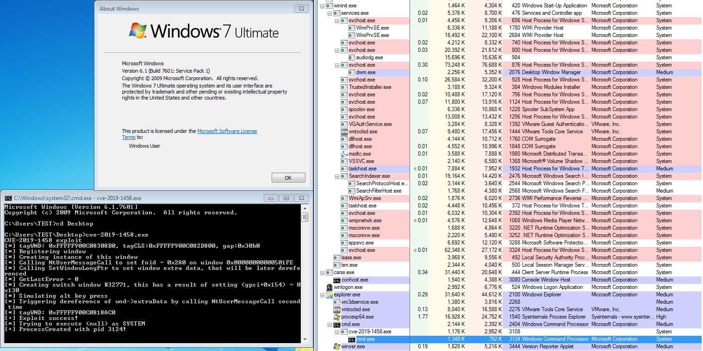

# CVE-2019-1458 : win32k Elevation of Privilege Vulnerability

## Writeups
Work-in-progress

### Supported Version

* Windows 2012 R2 (Tested)
* Windows 8 (Tested)
* Windows 2008 R2 x64(Tested)
* Windows 7.1 x64 (Tested)
* Windows 7 x64
* Windows 2012 x64
* Windows 2008 x64
* ALL X32 VERSION SYSTEMS ARE NOT SUPPORTED (Who uses x32 system nowadays?)

### Issues
* Kernel might crash when rebooting system after exploit 

### Tested VS
* Visual Studio 2015 :heavy_check_mark:
* Visual Studio 2017 :heavy_check_mark:

### Tested Environment
* Windows 7 x64

### PoC

## Reference
* https://github.com/piotrflorczyk/cve-2019-1458_POC
* https://cve.mitre.org/cgi-bin/cvename.cgi?name=CVE-2019-1458